# Keeping the Machines Running — three-story visual atlas

**Working design, 24 September 2026.** This is a divergent map for the Ken Round 2. It is a paper design. No Delhivery or Pine Labs integration or household test has occurred. The Gnani playground can inform voice dialogue only. A link in a diagram means a *proposed transition*, not proof that a partner performs it.

## The one job, and the candidate invention

**Household job:** “I can hand over the work of restoring my household function and stop chasing people, while keeping control of safety, access, property, and money.” The appliance is a means to a household function: clean clothes, cold food, safe water, cooling, or cooking. A technician visit is sometimes necessary; minimizing visits is an operating mechanism rather than the customer outcome.

**Agent job:** Maintain one accountable incident across people, evidence, permission, physical movement, money, contradiction, and recurrence. It plans, checks, asks, acts within authority, observes consequences, and recovers. It does not diagnose a dangerous physical fault as a fact from a call or pretend that a parcel scan proves a repair.

**Working invention to stress-test:** a **conditional repair commitment**. The household sees one meaningful promise and the next owner. Behind it, the agent maintains separate conditions: qualified worker accepted; candidate kit or honest diagnostic-only plan; household access agreed; payer's authorized scope; warranty route; shipment feasibility; test and recurrence policy. If one condition changes, the promise changes *before* a costly or unsafe action, and a named actor owns recovery. This is proposed orchestration and potential partner extensions, not a documented end-to-end feature of the three rails. Existing field-service vendors already offer parts prediction, truck inventory, contractors and work orders, so “AI brings the right part” by itself is not a defensible novelty claim. [S11–S13]

**Strategic company design from the team's current vision:** Tayyar is an agency-friendly maintenance operator, rather than only a booking marketplace. It builds a consented **Machine Passport** per appliance; seeks OEM or authorized parts agreements; holds or coordinates candidate kits, charges only for parts actually used under agreed terms, and returns unused parts. Independent parts sellers and a future marketplace can complement OEM sourcing where authorized supply is unavailable. Every inspection, installed SKU, functional test and recurrence can improve the next diagnosis, city-level stock decision and OEM negotiation. A broader parts marketplace, preventive maintenance plan, subscription or robotics training data is a *later option*, dependent on data rights, quality, repair outcomes and unit economics, not a feature guaranteed by today's calls. The conditional commitment is the operating promise; the Passport and parts relationships are the proposed compounding assets. This reconciles the team's `round2_vision.md`, `round2_strategy.md` and Vidya Sagar transcript with the maps.

### Diagram legend

- **V** Gnani voice/conversation; **L** Delhivery Maps or parcel logistics; **P** Pine Labs authorization/payment.
- **D** documented public building block; **I** integration/policy our system must create; **X** proposed partner extension, not demonstrated in supplied documentation; **U** eligibility, account access or performance unverified.
- **H** named human decides or performs physical work; **HOLD** preserves the incident with a reason, next owner and deadline. Colors: blue = household, teal = agent, amber = operation, purple = partner rail, red = interruption, green = evidence-backed exit.
- **D01–D31** are decision IDs. They recur in the master map, phase maps, decision ledger and actor journeys. **E01–E68** refer to the earlier edge-case catalogue; this atlas places those cases into branches and recovery routes.

## 1. The master mind map: everything belongs to an accountable incident

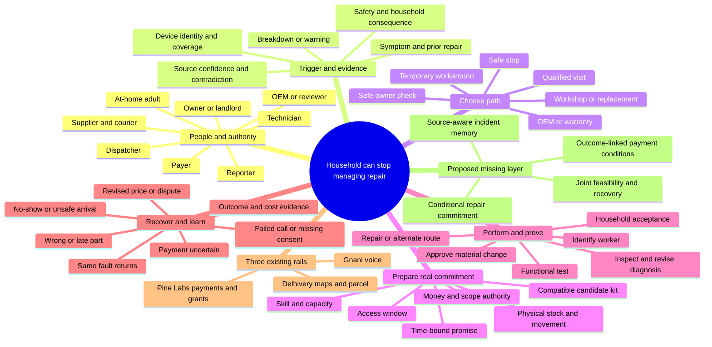

The mind map is a taxonomy. The next diagrams show causality, branches, loops and actors. It would be misleading to draw a single straight line: coverage can interrupt dispatch, stock can invalidate a slot, a technician can overturn the agent's hypothesis, and recurrence can reopen an apparently closed visit.

## 2. Master state-transition map — read top to bottom, then follow every exit

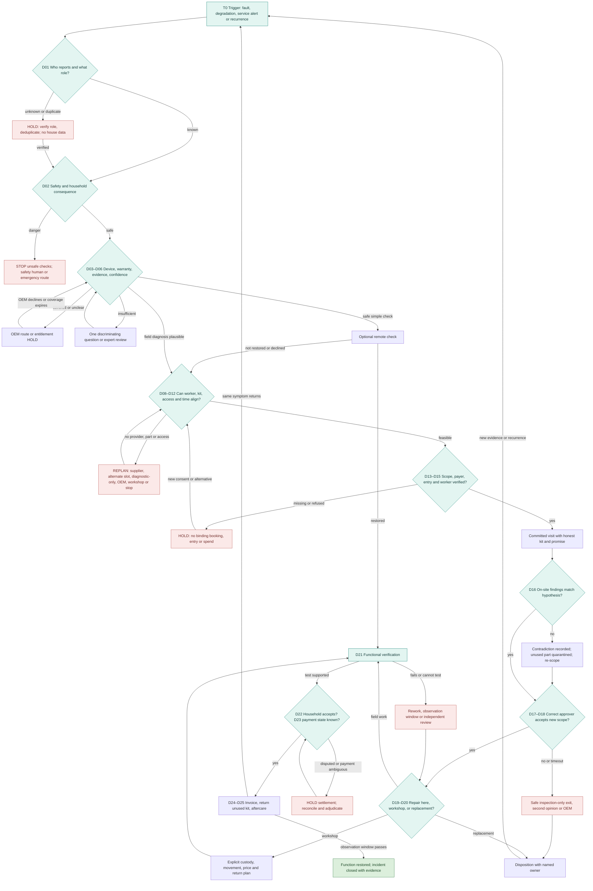

**Scope of the diagram:** “OEM route,” “safe stop,” “inspection-only,” “workshop,” and “replacement” are legitimate outcomes. **An incident is not called fixed because a worker arrived, a part shipped, or a payment settled.** A HOLD cannot remain indefinite; each hold records the current reason, owner, deadline and alternate path. The diagram compresses parallel tasks into one visual flow; the following map expands them.

## 3. Three parallel stories: the same event has three clocks

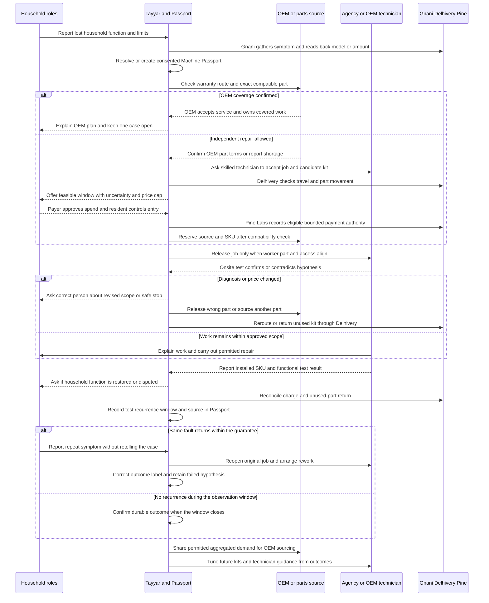

**Three stories and clocks:** The household measures time without a working function and effort spent chasing. The technician and agency measure paid, feasible productive work and travel; the OEM or source measures correct SKU demand and authorized supply. Tayyar measures the age of an unowned next action, evidence quality, consent, supplier cutoffs, profitability and promise reliability. The rail column shows *when* Gnani, Delhivery and Pine Labs participate; none independently diagnoses a machine or owns the repair result. The OEM branch and independent-agency branch rejoin at a prepared job. A wrong hypothesis returns the unused part and asks for a new scoped decision. A recurrence reopens the same Passport and original case; it is a negative outcome in training data, not a fresh success or automatic new full-price booking.

### The strategic data flow after every case

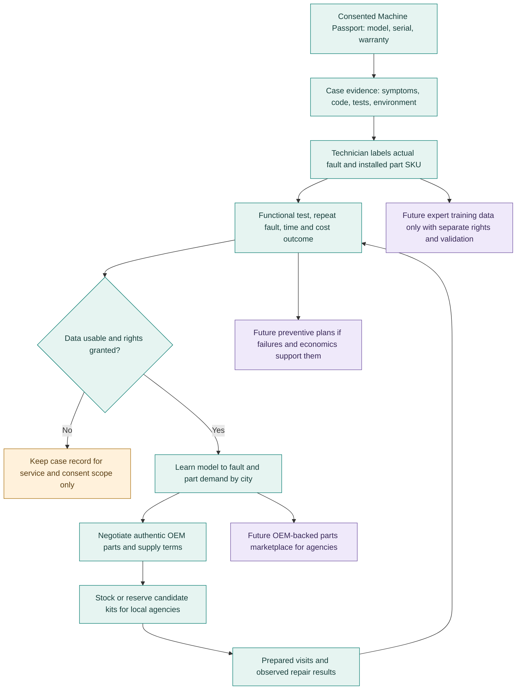

**Data is not a magical moat:** the first case may have no history; technician labels can be wrong; a successful one-minute test can hide recurrence; an OEM may not grant catalogue or repair-data rights; removing technician parts margin can reduce adoption. Preserve negative cases and source confidence. Compensate the technician for diagnostics and kit handling. Forecast and marketplace demand from actual used and returned SKUs, with consent and aggregation rules. A future subscription would require liability reserves and unit economics; training robots from repair video would require separate consent, capture, annotation, safety and proof that the data has that value. Those future outcomes are options in the company's strategy, not current Gnani, Delhivery or Pine Labs API outputs.

## 4. Phase maps: follow both branches at every decision

### M1 — Trigger, safety, roles and privacy (D01–D04)

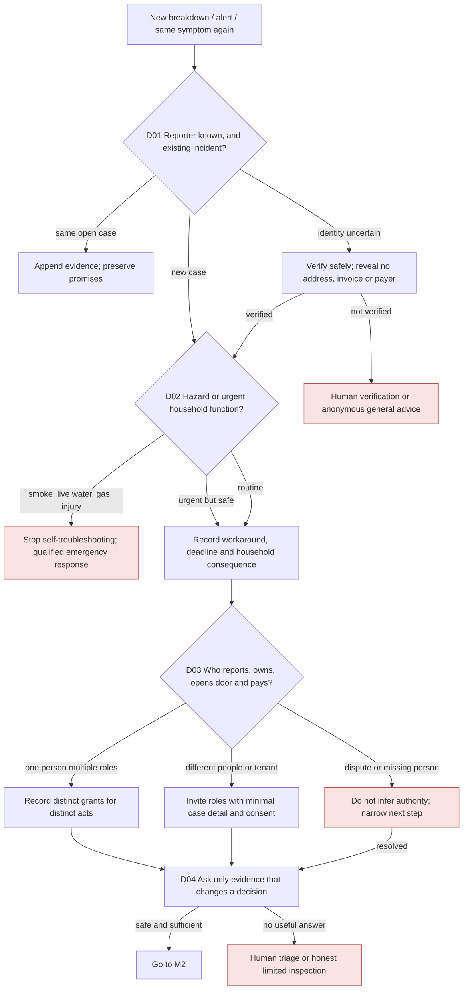

**Actor decisions:** The reporter chooses whether to engage and whether to attempt a safe check; the at-home person controls entry; the payer controls spend; the owner controls intrusive removal when applicable; the qualified professional owns physical safety. The agent may prioritize and ask questions, never synthesize absent permission. **Rail:** Gnani V-D for conversation and logs; marketed voice biometrics may support identity *if separately available and enrolled* (V-U), but identity is not spending or property authority. [S1–S3]

### M2 — Device identity, warranty, evidence and diagnosis (D05–D07)

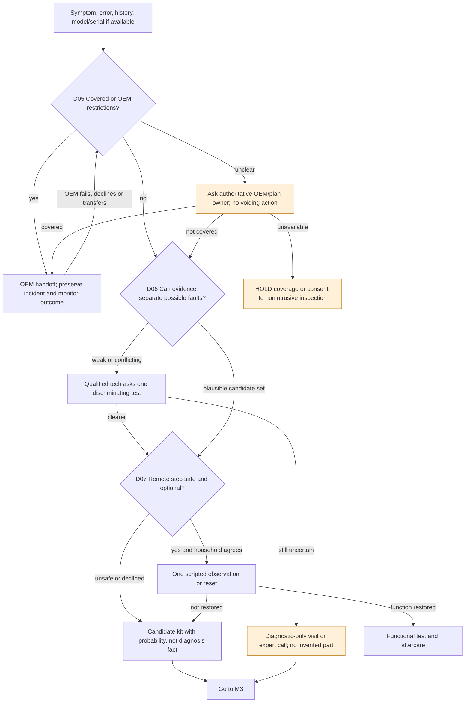

**Evidence ladder:** self-report < unverified transcript < image with readable model < OEM entitlement < qualified technician physical test for *that* fault. This is a design heuristic, not a universal ordering; a corrupted photo or stale OEM record can be wrong. Keep the exact original and source for conflicts. Potential multimodal acoustics or image fault classification is **not established by Gnani voice-agent docs**. It would need an external model, consent, appliance-specific validation and abstention. Voice can ask for a photo through another channel; it cannot make a photo trustworthy by reading it aloud.

### M3 — Plan, economic choice and joint preparation (D08–D13)

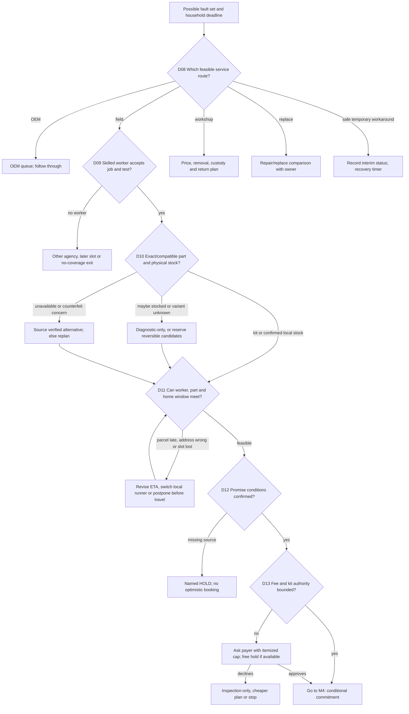

**Decision rule:** A candidate part is worth carrying only when expected saved delay and additional productive repair exceed part carrying, stock opportunity, damage, courier, return, and wrong-part risk. The technician must be compensated fairly for diagnostics and a job that changes after inspection; do not hide uncertainty to inflate a one-visit metric. Delhivery L-D gives geocoding/routing/matrix and parcel movement; it does **not** attest technician skill, live kit inventory or part fit. Pine Labs P-D can support links, scoped mandates and payments under eligibility; it does **not** adjudicate repair quality. [S4–S10]

### M4 — Commitment, doorstep access and changed findings (D14–D20)

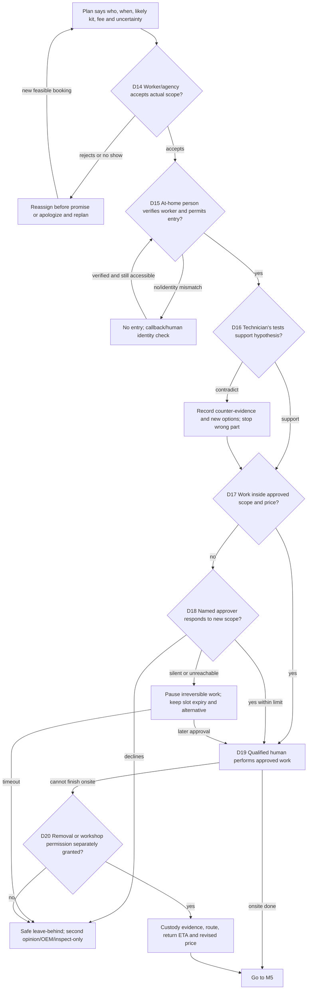

**Minute-level example of changed diagnosis:** 14:07 technician measures no inlet voltage; 14:08 marks AI valve hypothesis contradicted, photographs meter reading with consent and preserves old part unopened; 14:09 agent pauses the valve charge and tells payer “control-board fault is possible; inspection has not established repair”; 14:10 technician supplies safe options and range; 14:12 payer approves a specific diagnostic extension or declines; if silent at a stated cutoff the technician makes the appliance safe, documents an inspection-only exit and dispatcher owns the next plan. These times illustrate event order, not a promised response SLA. A voice “yes” without verified identity and exact scope does not trigger charge.

### M5 — Functional evidence, settlement, returns and recurrence (D21–D28)

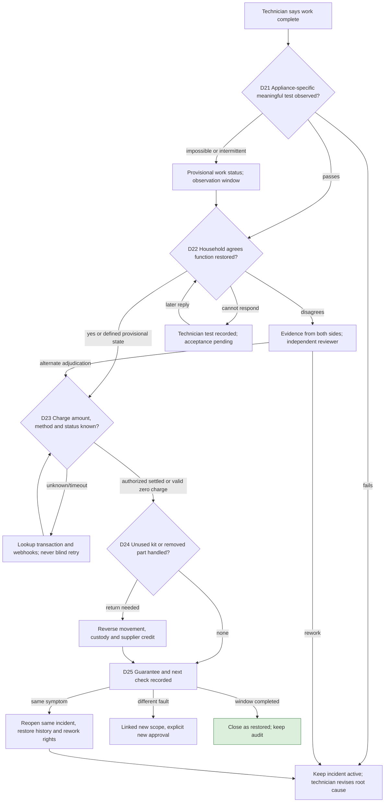

**Separate facts:** attendance ≠ inspection ≠ part installed ≠ functional test ≠ household acceptance ≠ durable fix ≠ settled payment. Pine Labs P-D can execute eligible payment states and refunds; split settlement and preauthorization are conditional on product and merchant eligibility and do not provide an unbiased repair arbitrator. A courier scan verifies parcel movement, not compatibility or successful installation. Recurrence loops to the *original* incident with all approvals and evidence, while a new unrelated fault creates a linked scope.

### M6 — Alternative routes and repeated disagreement (D26–D31)

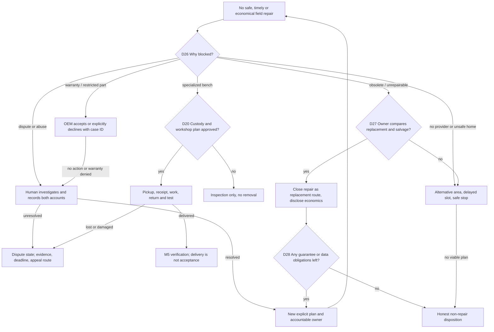

**Additional D29–D31 questions** are commercial rather than safety shortcuts: Is this a one-off fee or maintenance subscription? Who owns a guaranteed result and funds failed repairs? Can the provider afford the promised scope in this geography? A subscription and universal guarantee are mentor-suggested hypotheses, not an established profitable offer. Model usage, exclusions, adverse selection, kit working capital, and service availability before recommending it.

## 5. Decision ledger: source, authority, branch and rail

| ID | Trigger and agent's actual decision | Human or authoritative actor | Allowed forks and recovery | Rail at that point |
|---|---|---|---|---|
| D01 | Caller/alert maps to case and role | Reporter/identity authority | New, duplicate, recurrence, unknown caller → restricted triage | V-D; role registry I |
| D02 | Safety and function urgency | Household; safety-qualified human | Danger → stop; urgent safe → workaround; ordinary → continue | V-D; safety policy I |
| D03 | Identify reporter, payer, person at home, owner | Each role holder | Same person, split household, landlord, contested authority → HOLD | V-D; role proof I |
| D04 | Is added evidence worth asking for? | Household may decline | Photo/code/history, expert review, or limited inspection | V-D; multimodal model X |
| D05 | Warranty or protection entitlement | OEM/plan authority | Covered, uncovered, unknown → protected route | V-I; external entitlement U |
| D06 | Is diagnosis discriminated enough? | Qualified technician owns physical conclusion | High uncertainty → test; alternate candidates → kit; expert review | V-I; certified diagnosis X |
| D07 | Safe optional remote action? | Household and safety professional | Try, decline, hazard, failure → physical route | V-D; appliance safety policy I |
| D08 | Field, OEM, workshop, replace, workaround? | Household chooses material tradeoff | Several priced/time-bounded routes; stop allowed | All I; no rail chooses value |
| D09 | Worker skill, capacity, job acceptance | Dispatcher and technician | Qualified accepts, rejects, absent → reassign | L-D travel only; workforce I |
| D10 | Part identity, stock, provenance | OEM/supplier/technician | Verified kit, candidate, missing, counterfeit → alternate | L-D movement; fit/stock I/X |
| D11 | Movement and timing possible? | Supplier, courier, dispatcher | Kit, local runner, parcel, remote, postpone | L-D maps/parcel, eligibility U |
| D12 | Joint commitment still true? | All relevant parties attest their portion | Reserve, degrade to inspection, delay, cancel with owner | Cross-rail protocol X |
| D13 | Inspection and kit spend permitted? | Named payer | Exact cap/merchant/scope/expiry, manual payment, refuse | P-D P3P/links; repair policy X |
| D14 | Worker accepts terms | Technician/agency | Accept, decline, no show, change slot | V-D call; dispatch I |
| D15 | Worker may enter and do stated tests | At-home person/owner | Match, reject, late, absent, gate block → safe replan | V-I; L-D ETA; no rail owns entry |
| D16 | Findings confirm initial hypothesis? | Technician | Support, contradict, unsafe to test → evidence and replan | V-I context; provenance X |
| D17 | Changed scope/price beyond permission? | Technician proposes; payer judges | Within cap, new quote, second opinion | P-D amount; scope I |
| D18 | Approver responds before expiry? | Payer/owner | Accept, deny, silent → safe inspection-only | V-D contact; P-D status; policy I |
| D19 | Repair action and part installed | Qualified technician | Repair, fail, stop, replace part; retain test | No rail performs repair |
| D20 | Remove to workshop? | Owner/at-home person and payer | Approve separate custody+price, refuse → leave behind | L-D parcel B2B/B2C; custody I |
| D21 | Function restored by meaningful test? | Technician performs, household observes | Pass, fail, intermittent, cannot test → hold/rework | V-D reporting; independent proof X |
| D22 | Is customer willing to accept disposition? | Household | Accept, dispute, unreachable → provisional state | V-D follow-up; adjudication I |
| D23 | Payment/reversal state known? | Gateway is transaction authority | Success, failed, pending, duplicate → reconcile | P-D status/refund; merchant U |
| D24 | Kit and removed part disposition | Supplier/technician/courier | Used, returned, damaged, lost → custody and cost | L-D return; inventory I |
| D25 | Repeat fault within guarantee? | Household report; agency responsibility | Rework same case, independent review, different scope | V-D callback; cross-rail I |
| D26 | Why is field repair blocked? | Technician/OEM/agency | Warranty, skill, stock, safety, feasibility, dispute | All I |
| D27 | Repair or replace? | Owner/payer | Replace, workshop, wait, stop | P-D only for chosen transaction |
| D28 | May we close/stop? | Household or clear policy with appeal | Fixed, transferred, replaced, safely stopped, unresolved | Agent I; no silent closure |
| D29 | One-off vs maintenance model | Household and provider | Pay per case, plan, coverage; no implied subscription | P-D recurring tools; economics I |
| D30 | Who bears failed-repair liability? | Agency, OEM, platform contract | Rework, partial refund, neutral review, capped guarantee | P-D refunds; liability contract X |
| D31 | Is offer viable in this city/case? | Operator/finance/agency | Accept, constrain promise, referral or stop | L-D routing; contribution model I |

## 6. Actor decision maps: what each person can refuse, and what happens then

| Actor and trigger | Sees / feels / wants (feelings are hypotheses) | Their decision and right | If yes | If no, absent or contradicted |
|---|---|---|---|---|
| Reporter: machine stops | Lost function, uncertainty, effort; wants one owner | Report and share minimum evidence; request human | D01–D07, plan choices | No intrusive data collection; general safety or stop |
| At-home adult: slot or arrival | Address, name, time and safety; may not control money | Admit worker and permit stated inspection | D15–D16 | No entry; rebook without charging unauthorized work |
| Payer: fee or changed quote | Total, scope, cause, ceiling, expiry; fears surprise | Accept exact spend or mandate; decline | D13/D17/D18, payment status | Pause or leave in safe condition; show lower-cost route |
| Owner/landlord: intrusive work | Asset risk, warranty and responsibility | Authorize dismantling/removal when required | D20 and custody | OEM, limited inspection or leave-behind |
| Technician: offered case | Symptom confidence, kit, travel, pay, safety | Accept, reject, test, override agent | D09/D16/D19/D21 | Replan; no punitive forced part installation |
| Dispatcher/agency: queue or miss | Capacity, fairness, SLA and rework cost | Assign, replace, compensate or admit no coverage | D09/D12/D14 | Deadline-triggered alternate route with named owner |
| Supplier: part hold | Exact variant, who pays, unused return rules | Attest stock/compatibility or decline | D10/D11/D24 | Release optimistic slot; source alternate |
| OEM/protection provider | Model, serial, claim and authorized channel | Confirm eligibility and route | D05/D26 | Explicit denial or unresolved; no fake warranty status |
| Courier/local runner | Package, pickup time, destination, custody | Accept movement, scan, flag failure | D11/D20/D24 | Replan worker/part rendezvous; never treat AWB as stock |
| Human reviewer | Conflicting, unsafe, disputed or stalled case | Adjudicate and assume named ownership | D22/D26/D30 | Escalate with evidence and deadline; no silent loop |
| Agent | Every new event and timeout | Choose permitted next action, abstain or escalate | Advance only if guards true | HOLD or alternate; expose reason and owner |

**Interaction surfaces:** reporter voice or simple text with one next question; person at home identity and entry card; payer itemized scoped request and expiry; technician compact evidence/test/kit screen or voice readback; dispatcher ranked constraint-aware queue; supplier structured SKU/stock hold; courier pickup/return request; OEM claim packet; reviewer incident timeline with provenance and unresolved conflict. The agent must reconcile these surfaces; they do not all need one consumer app.

## 7. All edge classes mapped to a recovery branch

The original catalogue E01–E68 is retained in the earlier [Word design map](Ken_Round2_Stakeholder_Journeys_and_Agent_Workflows.docx). This index places *every ID* into a live route. “Recover” means named owner, deadline and exit condition, not endlessly retrying the same API.

| Branch in maps | Included edge IDs and examples | Recovery state and release condition |
|---|---|---|
| Safety stop, M1 | E01–E07: smoke, live water, gas, exposed wire, self-repair hazard, duplicate complaint, false preventive alert | STOP to safe professional or incident dedup; reopen only with safe conditions verified |
| Evidence/coverage, M2 | E08–E15: missing model, mistaken serial, contradictory sound/video, warranty unclear, prior repair, part appearance, spoken code error | EVIDENCE/ENTITLEMENT HOLD; authoritative OEM or technician test releases |
| Authority/contact, M1/M4 | E16–E23: wrong household role, payer absent, landlord conflict, access safety, OTP/call failure, voice consent ambiguity, duplicate mandate, revoked permission | AUTH HOLD; exact person and action verified; expired or revoked grant is never reused |
| Provider/scheduling, M3/M4 | E24–E33: technician rejects, skill mismatch, no show, late arrival, building entry, early tech departure, overbook, schedule change | REPLAN; worker accepts and household agrees a new truthful slot |
| Part/physical movement, M3/M6 | E34–E42: wrong SKU, alleged stock, no delivery coverage, parcel late, duplicate shipment, loss/damage, unused kit, workshop custody, counterfeit concern | RESOURCE/CUSTODY HOLD; supplier/runner evidence and cost owner recorded |
| Price/payment, M4/M5 | E43–E52: quote exceeds grant, ambiguous spoken approval, pending or double charge, changed merchant, cash provider, refund timeout, ineligible split settlement | FINANCIAL HOLD; gateway status reconciled, payer informed, safe work scope respected |
| Test/recurrence, M5 | E53–E60: brief pass, household disputes, same fault returns, new fault, cannot test, replacement, unreachable reporter, early provider closure | PROVISIONAL/REOPEN/REVIEW; no fabricated acceptance or new full-price incident by default |
| System/market, all maps | E61–E68: ASR corrupt model, provider outage, out-of-order events, inconsistent stock, data leak, agent loop, integration unavailable, no city provider | MANUAL OWNER/SAFE STOP; evidence and incident state preserved; no invented success |

**Additional cross-branch stress cases:** a child answers the phone; reporter and payer share one handset; owner changes during a rental; outage during partial repair; suspected harassment by a visiting worker; a replacement part fails within supplier warranty; prepaid part cost exceeds inspection grant; one part is shared across two concurrent jobs; carrier marks delivered at gate rather than technician; technician asks for cash while platform order is pending; agency tries to close an unresolved ticket; or the machine performs one test cycle but fails under normal load. Each enters the corresponding row above and preserves actor, evidence, authority, next owner and deadline.

## 8. Rails overlay: present capability versus the extension worth asking for

| Stage | Gnani voice | Delhivery maps/parcel | Pine Labs payment/authorization | New missing interface if the thesis survives |
|---|---|---|---|---|
| Intake/safety | Conversational agent, speech, logs, integrations **D**; role-sensitive safety policies **I** | Address interpretation and verification **D** if appropriate | None yet | An incident schema retaining original observation and speaker role **X** |
| Evidence/coverage | Custom action to our records **D**; OEM lookup requires access **U** | None | No payment authorization implied | Evidence provenance and conflict semantics across callers, photos and tests **X** |
| Plan and appointment | Explain alternatives, callback **D/I** | Geocode, routes, matrices, MCP **D**; parcel feasibility **D/U** | Disclosed inspection fee/payment link **D/U** | Joint worker–part–access reservation with expiry and replanning **X** |
| Kit and physical movement | Read back model/variant **D/I** | B2C/B2B shipment, tracking, reverse **D/U**; local on-demand availability **U** | Scoped kit/inspection spend possible **D/U** | Item-level purpose, part ownership and missed-rendezvous liability **X** |
| Doorstep and revised diagnosis | Speak with correct role, log disagreement **D/I**; marketed biometrics **U** | Travel ETA **D**; no human credential proof | Grantex/P3P scoped payments **D/U**, repair-specific change policy **I** | Machine-readable changed-scope consent bound to observed test **X** |
| Repair and proof | Technician reports test by voice **D/I** | Shipment/custody event only; no proof of function | Eligible card auth/capture or Reserve Pay conditions **D/U** | Evidence-backed repair outcome predicate and dispute route **X** |
| Settle/aftercare | Proactive callback, case summary **D/I** | Return unused part **D/U** | Refund, split settlement where enabled **D/U** | Conditional release or rework reserve with neutral adjudication, eligibility/legal design **X** |

**Capability correction:** Gnani markets voice biometrics, so “voice identity verification” is not a new product concept; we have no basis to claim it is exposed in this team's playground or that it verifies property/spend authority. Delhivery Maps already exposes an MCP server, routing and distance tools; merely connecting an agent to maps is not a new invention. Pine Labs already offers P3P, Grantex spending scopes and mandate-based agent payments; a “capped agent wallet” is not new. [S1–S10]

### Proposed extension for each company — separate from current API claims

1. **Gnani: role-and-evidence voice event,** not another voice bot. A structured event carries who spoke, language/transcript confidence, exact quoted amount/model readback, source artifact, what was contradicted, and whether that speaker has authority for *this action*. The external incident service decides action. Gnani could sell high-trust voice workflows and analytics for after-sales categories; feasibility depends on access to call metadata, consent and dependable role checks. Product signal: Gnani already markets enterprise multilingual agents, tools and voice biometrics; the proposed addition is a repair-specific provenance/permission interface, not biometrics itself. [S1–S3]
2. **Delhivery: repair rendezvous and exception API,** not another tracking number. A mission ties a part variant, supplier-ready assertion, courier cutoff, technician location/window and permitted handoff; when one misses, it returns a revised feasibility window *before* technician travel, with unused-part reverse and loss owner. Delhivery could sell higher-value intracity movements and lower failed pickup/returns. The partner currently documents Indian maps, parcel and local services, not an integrated technician/part/household promise; live worker capacity still comes from an agency. Public shareholder materials indicate Delhivery invests in maps, intracity operations and agentic logistics, which makes this a plausible *adjacent proposal*, not a forecast or commitment. [S4–S6]
3. **Pine Labs: repair-scoped contingent mandate,** not basic agent payment. One policy distinguishes inspection, optional kit reservation, approved installed part, revised diagnosis, dispute, rework reserve and refund. It binds a scope version and evidence/appeal state to eligible settlement release while leaving payment-network and merchant eligibility intact. Pine could earn platform/payment volume and reduce disputes in service commerce. P3P already supports bounds and agent payments; split settlement exists with activation and onboarding constraints. An outcome predicate that responsibly handles physical-work disputes is a new product-and-operations proposal; a gateway cannot itself judge whether a washer works. [S7–S10]

**Cross-company invention:** a shared, signed *repair commitment event* with: incident ID; role and actor; scope version; source and confidence; resource reservations; deadline; spending grant reference; permitted action; physical custody; objective test; disputed status; expiry; and recovery owner. This would be maintained by the incident operator, not magically provided by three unrelated APIs. A partner could expose selected fields and attest only its own fact. Release conditions must tolerate eventual consistency, duplicate webhooks and asynchronous human evidence; an “atomic transaction” across three companies is a conceptual goal, not a demonstrated technical guarantee.

## 9. Competitor and strategic-direction reality check

| Domain | Existing product/market signal | What this removes from our novelty claim | Adjacent proposal for the partner; hypothesis, not prediction |
|---|---|---|---|
| Voice | ElevenLabs documents REST tools and call transfer; Gnani documents integrations and markets voice biometrics. [S1–S3, S14] | “Voice agent calls APIs, hands off, recognizes caller” is generic. | Evidence/authority-aware incident conversations across a family and service workforce. |
| Field service / logistics | Microsoft Field Service tracks truck stock, purchasing and returns; ServicePower publicly previews AI parts prediction and vetted contractors; Servify's API reference spans repair, logistics and payment partners. [S11–S13] | “Right technician with parts on first visit” and “link all service partners” already have precedents. | Delhivery adds time-bound part handoff and truthful route replanning to independent repair providers, with the agent preserving consumer commitment. |
| Agent payments | Pine Labs P3P/Grantex has scopes, mandates and audit; Visa describes user payment instructions and agent tokens; Stripe has scoped shared tokens. [S7–S10, S15–S16] | “Agent pays up to a cap” and general conditional purchase are not new. | Conditional physical-service scope version, test evidence and disputed completion, with a real adjudicator and merchant agreement. |

**Strategic assessment:** Delhivery has the clearest directly evidenced near-term adjacency because it already combines Indian location intelligence with intracity and parcel infrastructure; yet technician orchestration is outside its documented maps/parcels and needs a service partner. Gnani can own trustworthy multi-person voice interaction but should not be assigned financial/property authority from voice alone. Pine Labs can carry bounded financial authority, but outcome-conditioned physical service introduces dispute and regulatory/merchant constraints. All three might reject the extension; the paper design still works in a limited form using the documented tools plus human dispatch and manual dispute handling.

**Novelty test before a submission claim:** Is the capability already in partner documentation? In a competitor? Is the claimed new behavior a feature, a cross-company contract, or just our own workflow? Who has to supply data and accept liability? What remains possible if they do not? On current public evidence, claim **“a proposed cross-party repair commitment protocol and recovery design not demonstrated in the supplied partner documentation”**, not **“no company has solved this.”**

## 10. Feedback loops: the system should stabilize commitments, not maximize automation

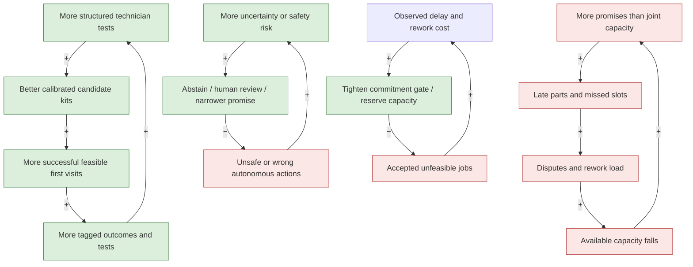

- **R1 learning (top left):** more reliable labeled outcomes can improve kit choices, which generates more useful observations. Prevent a false flywheel by logging *negative* and abstained cases, unused parts, latent recurrence and model drift; never train only on successful jobs.
- **R2 overload (top right):** overpromising consumes rework capacity and worsens future promises. This reinforcing loop is harmful. A service business can appear to grow while contribution and trust deteriorate.
- **B1 safety (lower left):** uncertainty increases abstention and human review, reducing harmful actions. It also creates delay; set an owner and timed fallback so safety does not become abandonment.
- **B2 feasibility (lower right):** missed outcomes tighten commitment rules, reduce infeasible jobs and eventually reduce misses. Constrain the model with fairness and access: do not silently exclude low-density areas because they look expensive. “Equilibrium” is not guaranteed; new demand, shortages and incidents can shift it.

## 11. Candidate architecture and autonomy boundary

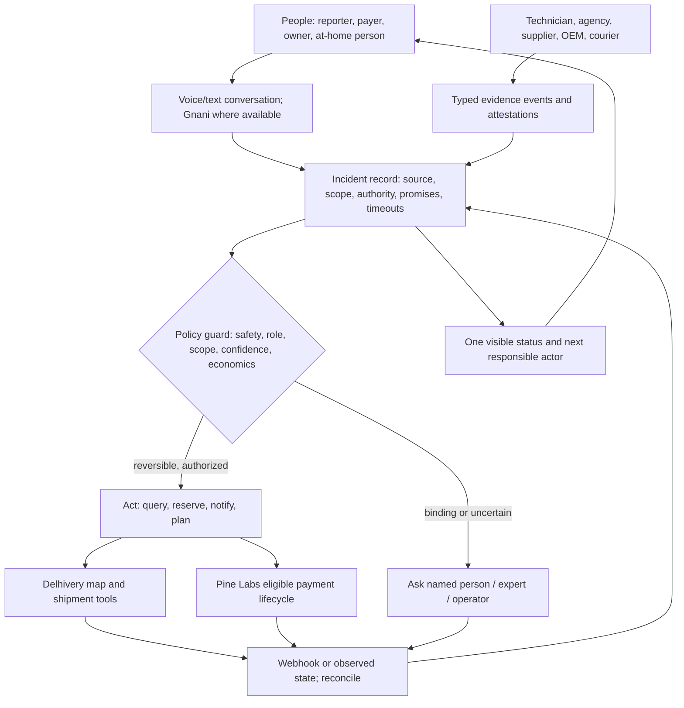

The incident operator owns source-specific state and recovery. The model proposes and explains; deterministic guards enforce authorized scope and payment/entry checks. Partners attest facts only inside their domain. A technician can contradict a hypothesis. A customer can decline remote steps, entry, price or removal. A reviewer owns conflict. No actor's silence is consent. A no-provider city receives an honest alternate disposition, not a fake “scheduled” state.

## 12. What to decide together next

The maps preserve two operating choices because they radically change the business and novelty:

1. **Who owns the guarantee?** Agency-managed coordination can begin with existing providers but cannot promise every repair result. An operator-owned maintenance guarantee can earn recurring revenue and stronger control but assumes parts, rework, fraud, geographic and capital risk. Mentor Vidya Sagar suggested owning maintenance and a candidate kit; that is a strategic hypothesis, not evidence of profitable insurance-like unit economics. [E6]
2. **Which constrained first category?** A washing-machine fill/drain problem provides a concrete story and safe test script only after expert review. A purifier outage has greater household urgency but more safety and warranty complexity. Broad “all household machines” makes fit, liability and evidence too variable for a truthful first promise.
3. **What exactly is delegated?** Define a one-time, role-specific permission matrix: contact and evidence; reversible slot; kit hold; inspected work; new spend; home entry; removal; verified payment. Make the first autonomous action explicit. The highest consequence action taken without asking determines the real autonomy claim.

**Preferred next design exercise:** take the four washing-machine outcomes from the earlier document and walk them through D01–D31. For each, make the household, technician/agency and incident agent speak separately; write the exact event, source, confidence, responsible human, rail call if any, next state, timeout and cost bearer. This is a paper walkthrough. It does not require code or inaccessible APIs.

## Source register

**Case and methodological material:** [Earlier stakeholder/edge-case Word map](Ken_Round2_Stakeholder_Journeys_and_Agent_Workflows.docx); [20-PDF research guide](Research_Resources_HCI_Agent_Design.md); attached household interviews, technician interview, Round 1 answers, master context, and mentor transcript. Interview quotes are translated/transcribed and not representative prevalence. E6 = `upload/Vidya Sagar round 2 transcript.md`. E01–E68 are the earlier design edge catalogue, not empirical incident counts. The design-method books informed roles, service blueprinting, sketching alternatives, visible feedback and error recovery; none proves the proposal works.

**Public company documentation and comparison (accessed 24 September 2026):**

- S1 [Gnani Agent Builder and custom HTTP actions](https://docs.gnani.ai/D05_Custom); S2 [Gnani voice biometrics marketing](https://www.gnani.ai/inya-shield-armour365-voice-biometrics-ai); S3 [Gnani technology overview](https://www.gnani.ai/technology).
- S4 [Delhivery Maps developer tools and MCP](https://www.delhivery.com/maps/developer); S5 [Delhivery One B2C](https://one.delhivery.com/developer-portal/documents/b2c/); S6 [Delhivery One B2B](https://one.delhivery.com/developer-portal/documents/b2b/); [Delhivery Q3 FY26 shareholder letter](https://www.delhivery.com/uploads/2026/01/LetterToShareholders_Q3FY26.pdf).
- S7 [Pine Labs P3P overview](https://www.pinelabs.com/docs/online-payments/ai/p3p); S8 [P3P quickstart](https://www.pinelabs.com/docs/online-payments/ai/p3p/quickstart); S9 [split settlements eligibility](https://www.pinelabs.com/docs/online-payments/split-settlements); S10 [P3P launch and stated roadmap](https://www.pinelabs.com/media-analyst/the-ai-agent-can-now-pay-pine-labs-launches-p3p-indias-first-agentic-payment-protocol-built-on-upi).
- S11 [Microsoft Field Service inventory, truck stock and returns](https://learn.microsoft.com/en-us/dynamics365/field-service/inventory-purchasing-returns-overview); S12 [ServicePower parts prediction and contractor network, a company preview](https://www.servicepower.com/blog/servicepower-previews-ai-on-demand-home-services); S13 [Servify partner API reference](https://integrations.servify.com/).
- S14 [ElevenLabs external tools and transfer](https://elevenlabs.io/docs/eleven-agents/customization/tools/webhook-tools); S15 [Visa Intelligent Commerce instructions](https://developer.visa.com/use-cases/visa-intelligent-commerce-for-agents); S16 [Stripe scoped shared payment tokens](https://docs.stripe.com/agentic-commerce/concepts/shared-payment-tokens).

Partner marketing and competitor previews indicate direction, not available access, measured performance or a committed 1–3 year roadmap. The Delhivery and Pine Labs APIs have not been exercised by this team; all API compositions and cross-partner semantics need contracts, credentials and negative-path testing in a later stage.
