# Tayyar — complete B2B repair operating system and visual flow atlas

**The Ken 2026 | Keeping the Machines Running | working design, 24 September 2026**

**Read this as the full intended operating system at maturity.** A missing integration stays in the flow. The tag beside it tells us who must build it or attest it. The diagrams describe a proposed product and business, not a claim that three existing APIs independently deliver the outcome. The team's chosen strategic direction is explicitly inside the system: OEM/authorized-dealer relationships, prepositioned kits, a consented Machine Passport, agency economics, and a later parts marketplace and maintenance business.

## 0. The problem, the customer, the commercial model and the key

**Household job:** “When an appliance breaks, take responsibility for getting my household function back, give me a truthful next step, and let me stop managing the repair.” Trust means identity, safe entry, authentic compatible parts, understandable prices, evidence of function, and someone accountable if it fails again. A first-visit fix reduces disruption; a diagnosis-only visit may still be the honest and safe outcome.

**Agency job:** “Turn technician hours, customer demand and parts access into completed repairs with fewer wasted journeys, without losing control of my workforce, margin or customer relationship.” Our B2B customer is a local service agency, including authorized service partners where contracts allow. The agency pays Tayyar for an agreed, verified result; it does not simply supply anonymous technicians to a consumer marketplace. The agency may bring its own household leads or receive leads subject to a separate acquisition agreement.

**Tayyar job:** Keep one accountable case across household, payer, agency, technician, OEM/dealer, parts, transport and settlement. Choose and revise a feasible plan; coordinate a *prepared* visit; record the actual result; use accumulated data and OEM/dealer agreements to improve the next case. Tayyar owns the agent and Machine Passport service. The agency owns its workers, accepts its repair obligations and can override an unsafe or infeasible plan; a payer controls spend and a resident controls entry.

**Illustrative B2B contract design to negotiate, not a proven business fact:** agency pays Tayyar a per-outcome success fee for verified first-visit fixes or an agreed gain-share relative to its own baseline. A lower orchestration fee can cover honest diagnosis-only cases, subject to agency agreement. Household inspection, labour, part and shipping charges are separate and itemized; Tayyar's B2B invoice does not authorize any household charge. A later parts marketplace may earn a disclosed distribution margin or transaction fee without hiding technician incentives. Avoid paying for a high first-visit rate achieved by rejecting difficult jobs.

**Capability key used on *every* stage map and in the ledger**

| Tag | Meaning | Examples and owner |
|---|---|---|
| **G** | Public Gnani speech/voice capability | STT/TTS or agent conversation; no implied appliance diagnosis or legal identity. |
| **D** | Public Delhivery maps/parcel capability, subject to account/serviceability | Geocode, matrix, shipment and tracking as applicable; no implied worker booking. |
| **P** | Public Pine Labs payment capability, subject to merchant/feature activation | Mandate, eligible capture/refund, payment receipt, activated split settlement; not physical repair adjudication. |
| **T** | Tayyar-owned logic and records in the fully designed product | Case engine, optimizer, Passport, evidence policy, agency billing, rights ledger, analytics. This is work our company must do. |
| **A** | Agency/technician human attestation or operational capacity | Roster, worker acceptance, technical test, liability, rework; an API cannot invent these facts. |
| **O** | OEM/authorized dealer/parts seller authority | Warranty, genuine part catalogue, fitment, stock, pricing, return policy; requires partnership. |
| **X-G / X-D / X-P** | Proposed new interface from a named partner, **not** established in supplied docs | Evidence and role events; worker-bound timed part rendezvous; condition-bound service settlement. |
| **X-O / X-A / X-4** | Proposed OEM, agency or cross-company infrastructure and contracts | Live stock hold; agency scheduling/rework API; portable Machine Passport with agreed rights. |

A tag of **P** means the financial *primitive* is supported, not that the outcome-specific charge policy exists. A node can combine tags, for example `T+D+X-D`; all required pieces are visible. **Green = intended progress; coral = recovery or safe stop; blue = agency/OEM controlled decisions; violet = later data-led products.** Diagrams use the same state IDs `S0–S11`, decision IDs `J01–J28`, and recovery IDs `R1–R12` throughout.

### Stakeholders: trigger, desired result, interface and non-delegable decision

| Actor | Trigger and mental model | What they see; their choice | Economic or trust consequence |
|---|---|---|---|
| Household reporter/user | Washer stops; “I need clean clothes and one responsible owner.” | Local-language call/text; one next step, credible worker identity, time window, outcome. Reports facts, may refuse recording or remote checks. | Less household management; cannot be silently billed. |
| Resident at address | Visit approaching; “Who is coming into my home?” | Name, agency, photo/verification, scope, arrival; accepts or denies entry. | Safety and convenience beat schedule optimization. |
| Payer, perhaps remote relative | Quote or changed finding; “What exactly am I authorizing?” | Itemized fee and maximum, merchant and expiry through suitable channel; grants, changes or refuses spend. | Spending limit is separate from reporter's speech and resident's entry. |
| Appliance owner/landlord | Warranty, dismantling or workshop removal; “Will my asset be damaged?” | Warranty route, custody form, replacement alternatives; controls removal and invasive work where applicable. | Competing rights require a hold, not inferred permission. |
| **Agency owner/operator, Tayyar's buyer** | More cases than skilled time; “Does Tayyar lift contribution per technician-hour?” | Agency console: cohort P&L, first-visit outcomes, disputes, kits, payable fee; adopts contract and sets SLA, liability and constraints. | Buys verified outcomes and protection from costly rework. |
| **Agency dispatcher** | Job enters queue; “Which worker, when, with what part?” | Ranked plans and reasons; can accept, change, batch, withhold scarce technician, escalate. | Manages roster, promised windows and freed hours. |
| **Technician** | Offered a prepared card; “Is it safe, paid, technically credible?” | Evidence, test plan, likely parts, wage/commission, route, customer access; accepts/refuses, diagnoses, attests work. | Must retain fair diagnostic pay and right to challenge AI. |
| OEM / authorized service center | Serial or warranty claim; “Protect policy, safety, part authenticity.” | Claim packet and authorized route; decides entitlement and allowed work. | Brand claims and service revenue; partnership governs data use. |
| Authorized dealer / distributor / local parts seller | Candidate demand or kit hold; “Will stock move and returns be fair?” | Exact SKU/variant, confirmed hold, paid/return terms; accepts or declines. | More predictable genuine-parts demand. |
| Delhivery / approved local runner | Pickup or return needed; “Which address and handoff deadline?” | Shipment instructions and custody scan; accepts within serviceability. | Movement proof is not part fitment or repair proof. |
| Tayyar operations / neutral reviewer | Unresolved conflict or exception; “Who owns resolution?” | Evidence trail and competing claims; resolves within policy and assigns remedy. | Prevents agent loops, arbitrary settlement and silent closure. |
| Enterprise buyer or later marketplace merchant | Repeated stock demand; “Can we procure predictable SKUs?” | Aggregated trends, contracts, catalogue and marketplace orders with rights. | Strategic second business built from actual outcomes. |

## 1. Master system map: an agency business, a household case, and a compounding supply network

Follow green to a completed case; coral is a real alternative path with a named owner. The violet loop takes *verified* case outcomes into the next case. Each box names its operating owner and capability tags.

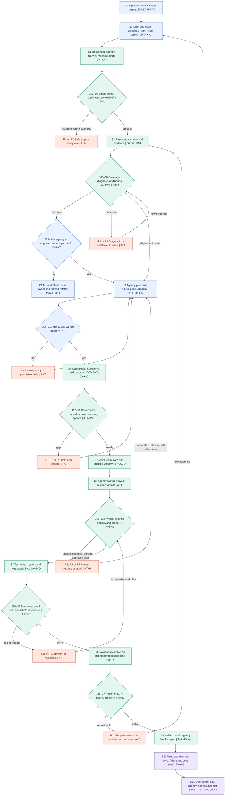

**The master map contains both today and tomorrow:** a new Tier 2 agency with no historical cases can begin with model photos, technician attestations and dealer calls; a mature city can use consented Passport history, integrated OEM stock, forecasted kits and automated scheduling. The state definitions and decision rights are unchanged. Missing interfaces do not disappear from the intended flow; they become explicit `X` dependencies.

## 2. Three simultaneous stories and their decision clocks

The sequence shows event causality; stages in the next section show every branch. **Five participants maximum** keeps it readable. The agency is a party to every promise and Tayyar's paying B2B customer, rather than an interchangeable worker pool.

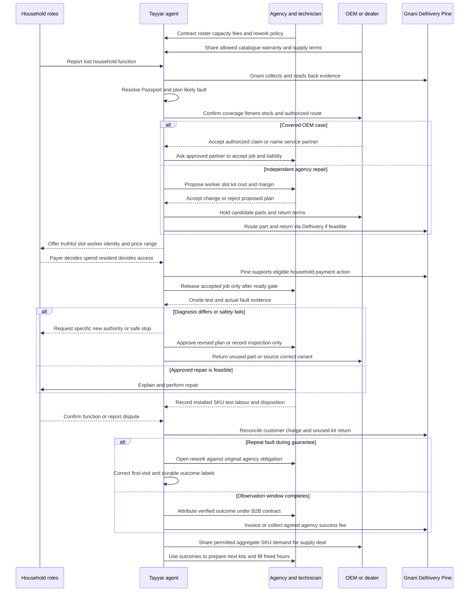

**Clock 1, household:** hours without a function, number of follow-ups and surprises. **Clock 2, agency:** capacity before slot expiry, paid productive hours, inventory cash and rework. **Clock 3, Tayyar and OEM network:** evidence aging, stock cutoff, reliable labels, contribution per successful case and true demand by SKU. The agent has to reconcile all three; an agency can reject an unsafe or unprofitable slot, and that rejection must revise the household promise before departure.

## 3. Stage maps: from market setup through the next generation of the system

### S0 — Before a customer calls: agency tenancy, contracts, genuine supply and city capacity

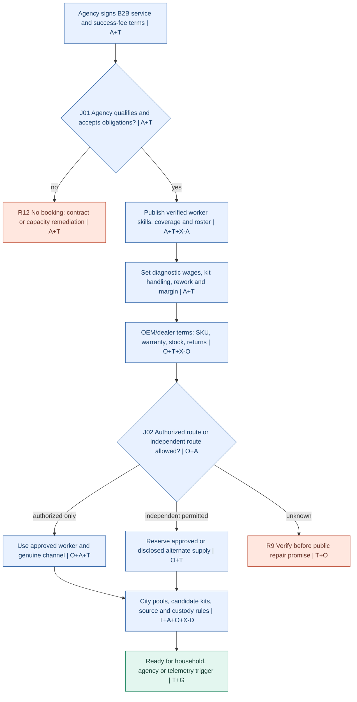

**Agency decisions:** join and set lead ownership; disclose worker availability and true skill; accept proposed kit-loss allocation; fix hourly/diagnostic wage and technician parts-margin replacement; approve warranty and return policy; agree when Tayyar may auto-book within roster and when dispatcher sign-off is mandatory. Tayyar cannot manufacture a live roster, technician insurance or a local OEM agreement from voice, payment and parcel APIs. At mature scale, partner-published slots and stock make these checks faster (`X-A`, `X-O`). If an agency withdraws capacity, Tayyar removes it from the ready gate and reprices the city, not the already consented household transaction.

### S1 — Trigger, safety, identity, lead ownership and household roles

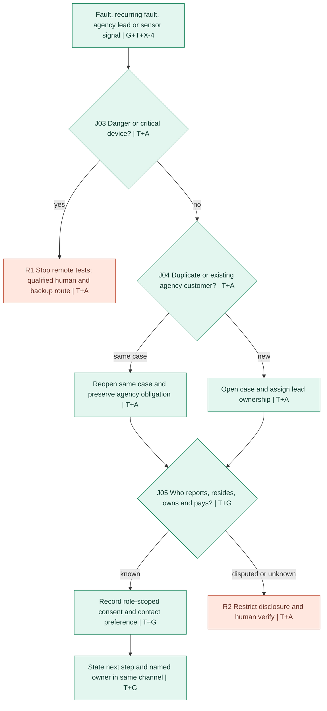

**Detailed exits:** gas, exposed wiring, sparks, flooded sockets, or a life-critical machine trigger a human safety route. A child at home is not presumed authorized. One shared phone can have different reporter and payer identities. A call from a new number yields general safety help until role verification. For an agency-sourced lead, Tayyar records the agency account and contract attribution before generating any B2B fee. A possible future telemetry trigger may call the household proactively only within separately granted permission; it is `X-4`, not a capability inferred from Gnani.

### S2 — Machine Passport, entitlement, evidence and diagnostic uncertainty

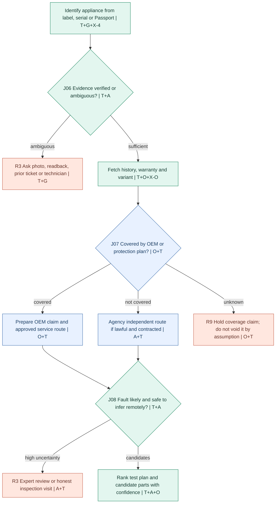

**Agent actions at maturity:** combine consented model/serial, earlier fitted SKU, field findings, manufacturer service bulletins if licensed, local failure patterns, optional appliance telemetry, customer-recorded symptoms and technician expertise. Do not equate a historical correlation with a confirmed diagnosis. The technician chooses and records safe tests. For a covered appliance, use OEM-authorized procedures and assignment; the agency may be that service partner or may lose the job and still get an agreed intake/referral fee if contracted. `X-O` covers entitlement and catalogue access; `X-4` covers portable Passport rights.

### S3 — Agency proposal, technician selection, commercial fit and capacity recovery

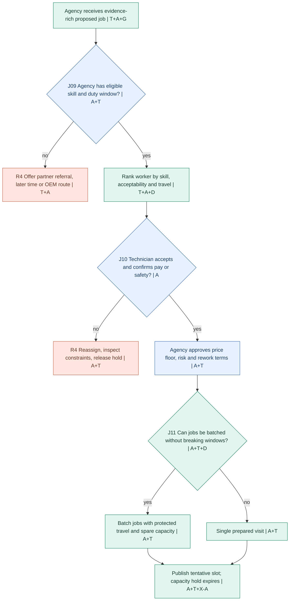

**Agency economics at this decision:** maximize verified repairs per available technician-hour *subject to* wage, travel, spare parts cash, risk and household promised window. The dispatcher may override a proposed assignment with a reason; the technician may refuse if training or safety is inadequate. Tayyar shows expected contribution, source and uncertainty, not a false guaranteed margin. Capacity released by fewer returns earns nothing until the agency refills it with paid jobs; the dispatch view explicitly offers the next suitable job. `D` supplies journey geometry, not worker schedules or labour economics. `X-A` is a future agency workforce/capacity interface.

### S4 — Part supply, kits, handoff, custody and reverse logistics

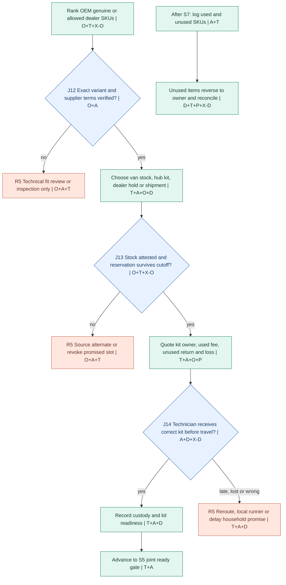

**Mature supply model:** direct OEM and authorized distributor pricing where permitted; city-level candidate kits at agency or hub; pay only for used parts under negotiated consignment or return terms where actually agreed; an agency-facing marketplace lets authorized suppliers fulfill forecasted SKUs. The agency decides who holds its van stock and whether a kit affects technician commission; the technician checks physical variant before opening a seal. A parcel “delivered” to a gate is insufficient. `X-D` is the proposed appointment-bound *worker handoff with deadline, exception and return custody*, beyond ordinary parcel movement. On-demand same-day Tier 2 availability must be checked city by city; do not promise it from a map API.

### S5 — Three-party ready gate, household authority and honest commitment

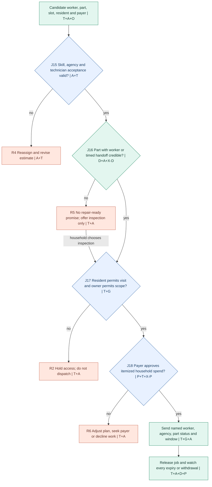

**The actual joint promise:** `worker accepted AND agency risk accepted AND compatible candidate part/diagnostic tools feasible AND household access agreed AND payer's scoped budget valid AND OEM policy respected AND travel window still possible`. Every reservation expires. A capable agent can negotiate changes with the agency dispatcher and household within predetermined limits, but cannot approve its own technician, invent physical stock, grant house entry, or use a payer's voice “yes” to create an undisclosed mandate. `P` is a payment primitive; household repair-specific contingent authorization is `T+X-P`.

### S6–S7 — Doorstep, contradictory findings, safe repair and alternate routes

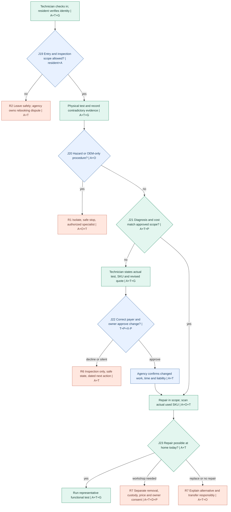

**Minute-level contradiction protocol:** 14:07 technician finds that the predicted valve fault is actually a control-board symptom; 14:08 records measurement and unopened valve; 14:09 Tayyar freezes the valve line item and tells the agency and payer that earlier confidence changed; 14:10 agency confirms technician is qualified, exact additional diagnostics, wage/time and part availability; 14:12 payer accepts a specified new scope or the worker documents an inspection-only exit. The times show ordering, not a guaranteed SLA. If an owner must consent to removal, that is another approval. A wrong model outcome reduces a future model's confidence rather than generating a false “first-time fix.”

### S8–S9 — Functional outcome, agency obligation, household money and B2B billing

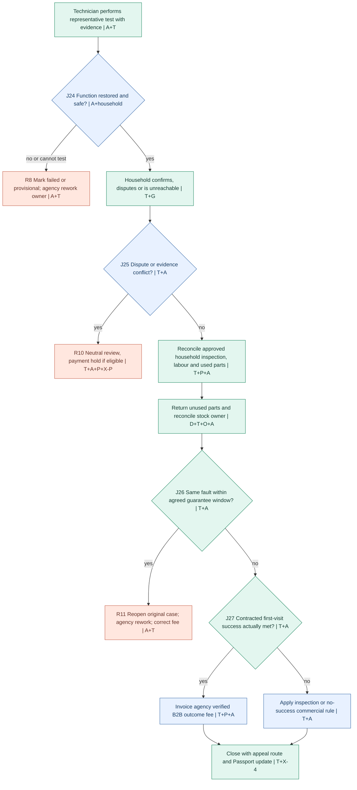

**Two money paths, separate ledgers:** (1) household or payer pays a clearly disclosed merchant for approved diagnosis, labour, used genuine part and shipping when applicable; refunds and unsettled status are reconciled to that merchant's contract. (2) the **agency pays Tayyar** a contractually defined success or coordination fee, based on independently recorded repair facts and adjusted for recurrence/rework. Pine Labs may support eligible mandates, hosted checkout, receipts, refunds and activated splits, but does not certify repair quality or automatically generate B2B outcome invoices. Distinguish merchant of record, part owner, tax treatment and settlement eligibility by contract. If agency collects household payment directly, Tayyar cannot silently split it; agency invoices Tayyar separately or explicitly onboards an eligible settlement arrangement.

**Success predicate:** an accepted, eligible household case had a first physical technician visit; the machine passed the agreed test for the reported function during that visit; customer or objective evidence confirms it within the observation rules; no same-fault recurrence inside the defined guarantee period. Inspection-only, unknown outcome, rejected difficult case and warranty referral are separately counted. A fee earned on provisional test can be reserved or adjusted later under contract; never represent an untested machine as fixed.

### S10–S11 — Passport learning, agency optimization, OEM terms and the marketplace

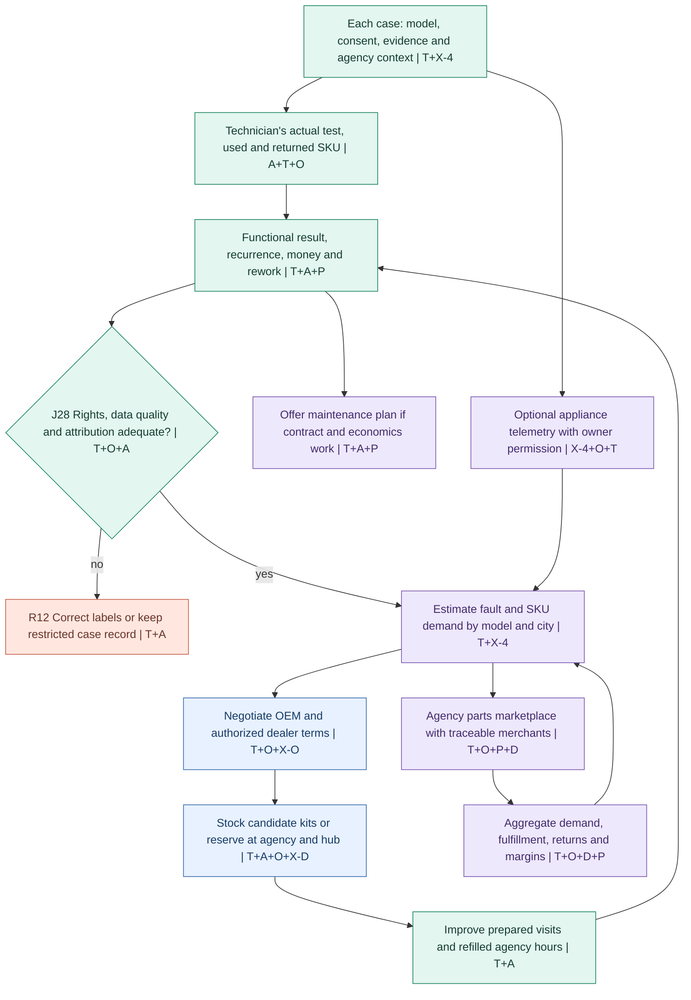

**Strategic business sequence:** first, prove agency economics and genuine-part access in a small Tier 2 geography. Second, use real consumed and returned SKU data to buy from OEMs/authorized distributors on better terms and place candidate kits near likely demand. Third, let multiple agencies buy traceable parts through a marketplace rather than forcing ownership of their household relationships. Fourth, where recurrence and economics support it, offer a maintenance or uptime contract with the agency, OEM or property manager. Optional machine telemetry, diagnosis licensing, resale/history or expert-training data are later products only with separate rights and evidence. This is the intended operating system at maturity, **including** features that require new contracts or capabilities.

## 4. Decision ledger: every key turn has an authority and a result

**Automation principle:** Tayyar may decide *which permitted next step to propose or execute*. Only the proper actor can attest a physical fact or grant a right. Its fully functioning mature version can automatically book, source, replan and invoice under pre-agreed contract rules; it still asks before new money, entry, custody, risky work, or a contract-boundary change.

| ID; state | Question and Tayyar's decision | Authority and information required | Happy exit | Unhappy exit and owner |
|---|---|---|---|---|
| J01; S0 | Can this agency enter a city/service class? | Agency owner signs roster, SLA, rework, data and fee terms; Tayyar verifies. | Agency tenancy live. | Contract hold, agency business lead. |
| J02; S0 | Can this provider repair this brand/variant? | OEM/dealer warranty and authorized-service rules, agency credentials. | Authorized or allowed independent route. | OEM referral or policy review. |
| J03; S1 | Is the complaint hazardous or life critical? | Reporter facts plus safety policy and qualified human. | Safe intake. | Human safe stop or emergency route. |
| J04; S1 | Existing incident, repeat or new agency lead? | Case history, agency lead ownership and recurrence. | One correctly attributed case. | Deduplicate or resolve ownership conflict. |
| J05; S1 | Who reports, resides, owns and pays? | Each actor's verified role and action-specific permission. | Limited data and appropriate communication. | Restricted conversation and human verification. |
| J06; S2 | Is model, serial and symptom evidence reliable? | Label/photo/readback and conflicting records. | Machine/variant hypothesis. | More evidence or technician inspection. |
| J07; S2 | Is warranty or coverage active? | OEM/protection authority, machine identity and date. | Protected or independent route. | Hold; never infer “expired” from silence. |
| J08; S2 | What can be predicted safely before arrival? | Model, records, safe symptom evidence, technician expertise. | Ranked test plan, candidate parts. | Expert review or openly diagnostic-only visit. |
| J09; S3 | Which agency has right skill and capacity? | Contract, live roster, competency and service area. | Proposed worker and deadline. | Refer or offer later slot; agency dispatcher. |
| J10; S3 | Does that technician accept? | Worker sees fair wage, travel, kit, risk, access and card. | Personal acceptance. | Reassign; agency dispatcher. |
| J11; S3 | Should jobs be batched? | Skill match, travel matrix, each customer's actual window and buffer. | Feasible multi-job route. | Keep single route; agency dispatcher. |
| J12; S4 | Is proposed SKU compatible and genuine/allowed? | OEM catalogue or dealer proof, model variant, worker review. | Candidate kit. | Stop wrong SKU; source/inspect. |
| J13; S4 | Is stock actually held with clear economics? | Supplier hold, expiry, ownership, unused return, loss rule. | Tracked reservation. | Alternate source or revise date. |
| J14; S4 | Is handoff to actual worker feasible before travel? | Worker acknowledgment, scans, deadline and location. | Worker or hub custody. | Runner/replan; agency and supplier. |
| J15; S5 | Is the agency and technician acceptance still valid? | Live roster/acceptance, skill, rework rule. | Retain worker. | Release booking; dispatcher reassigns. |
| J16; S5 | Does part or honest diagnostic plan meet promise? | Supplier/worker attestations and serviceability. | Ready gate can proceed. | No prepared-repair claim; agency revises. |
| J17; S5 | Is entry and work within household rights? | Resident and owner separate authorizations. | Address and access confirmed. | Do not dispatch; household contact owner. |
| J18; S5 | What household spend is permitted? | Named payer, exact quote/cap/scope/expiry and merchant. | Eligible payment grant and receipt. | Lower scope, manual approval or cancel. |
| J19; S6 | May the worker enter and inspect? | Resident visually verifies assigned worker and scope. | On-site diagnostic action. | Safe departure, agency owns resolution. |
| J20; S6 | Does physical finding require specialist or stop? | Technician physical evidence and OEM safety rules. | Continue permitted work. | Isolate, OEM route or emergency. |
| J21; S6 | Does changed diagnosis stay within approved scope? | Actual test, price, quoted part, agency economics and payer grant. | Repair within scope. | Pause and request revised decision. |
| J22; S6 | Who can authorize changed work? | Payer for price, owner for custody, agency for new liability. | New scoped version and schedule. | Inspection-only or transfer. |
| J23; S7 | Can function be restored on site? | Technician tests, part availability, household acceptance of option. | Repair and verify. | Workshop/removal consent, wait, replace, or close unresolved. |
| J24; S8 | Is the reported function restored safely? | Representative test and household observation. | Provisional repair success. | Failed or indeterminate; agency rework. |
| J25; S8 | Is there a dispute or contradictory proof? | Household, technician, test, media, neutral reviewer. | Reconcile allowed household charge. | Dispute hold and adjudication owner. |
| J26; S9 | Did the same fault recur in guarantee window? | Follow-up, coded issue, qualified review. | Stable outcome after observation. | Reopen same case; agency liability. |
| J27; S9 | Was this a billable B2B first-visit success? | Contract cohort, first-visit evidence, exclusions, recurrence. | Invoice agency outcome fee. | Inspection or no-success tariff and explanation. |
| J28; S10 | Can case data improve future jobs or be shared? | Household, agency, OEM rights; quality and provenance. | Learning, forecasts and allowed aggregate insights. | Restricted storage, correction and deletion route. |

### State invariants: rules that survive loops and scale

1. One real-world incident has one stable ID; a duplicate webhook or repeat call must not create a new household charge or B2B success fee.
2. No “repair ready” state without an agency/technician accepted job, compatible part **or plainly diagnostic-only plan**, household access, route feasibility and valid financial scope.
3. An OEM coverage claim is decided by an authority, not an LLM; an independent agency cannot quietly take a protected job outside brand rules.
4. “Shipped,” “delivered,” “worker checked in,” “paid,” “voice says yes” and “functional test passed” are different events; none substitutes for another.
5. A claim from a technician is useful evidence, not a payer's authority; the agency can dispute labour or part attribution without erasing what the household saw.
6. A human exception has an owner, deadline, reversible actions, a next notification and a stopping condition.
7. Provisional success, durable success and contract-billable success are distinct states. Count failures, unknowns and excluded cases in transparent cohorts.
8. Passport records preserve source, speaker role, consent, scope version, confidence and corrections, including failed predictions and unused parts.

## 5. Capability overlay: what we use, what Tayyar builds, what we ask each rail to add

The work is designed in the **left** columns first. The present partner primitive and missing dependency are overlays. `G/D/P` means supported component in public documentation, not proof that our account has credentials, that a city has same-day service, or that the integrated product exists. The diagrams above show those missing dependencies in place.

| Workflow touch point | Designed action / value to agency | Gnani `G` | Delhivery `D` | Pine Labs `P` | Tayyar, agency, OEM and missing partner interface |
|---|---|---|---|---|---|
| S0 agency onboarding | Contract prices, skills, labour, wage, guarantees | Talk through onboarding if useful | Location and travel envelope | B2B checkout/invoice payment if eligible | `T+A+X-A`: roster and fee contract; `X-O`: authorized coverage agreements. |
| S0 genuine supply | OEM model/SKU and dealer economics | Seller calls using speech stack | Warehouse location/serviceability | Dealer payment where merchant enabled | `T+O+X-O`: catalogue rights, real stock/hold and returns. |
| S1 call and roles | One case and correct role | STT/TTS and voice agent interface, language-dependent | Geocode rough address as needed | None until payer approval | `T`: role registry; `X-G`: structured provenance/readback/authority event. |
| S1 machine alert | Catch emerging fault before the household calls | Outbound contact if supported by deployed voice setup | None | None | `X-4+O`: consented OEM telemetry or sensor evidence; distinguish signal from diagnosis. |
| S2 Passport | Retrieve past repairs, serial, fitted part | Confirm spoken model/code | None | None | `T+X-4`: portable consented history; `X-O`: OEM entitlement. |
| S2 fault hypothesis | Narrow safe test and candidate kit | Transcribe description; synthesize next question | None | None | `T+A`: machine reasoning and technician validation; `X-G` for multimodal acoustic evidence if partner builds it. |
| S3 agency matching | Skilled worker and profitable roster | Call and read back terms | Geocode, routing, distance/time matrix | None | `T+A+X-A`: roster, acceptance, compensation, liability. `X-D` worker-aware timing only if partner adds it. |
| S3 batching | Refill freed hours with suitable jobs | Notify changes | Route/distance inputs | None | `T+A`: constraint optimizer and dispatcher override. |
| S4 source kit | Authentic variant at right location | Supplier conversations | Forward parcel/B2B movement where serviceable | Supplier/part payment where eligible | `T+O+X-O`: live stock, SKU fit, ownership and returns. |
| S4 handoff | Part reaches assigned worker before appointment | Notify recipient | Tracking and pickup/return primitives | Possible deposit or supplier charge | `T+A+X-D`: worker and visit bound rendezvous and at-risk webhook. |
| S5 promise | Joint feasible commitment to household | Explain slot/limitations | Delivery and travel estimates | Mandate, scoped agent initiation subject to setup | `T+A+O`: joint ready gate; `X-P` item/scope/service evidence binding. |
| S5 household spend | Separated reporter, resident, payer | Read amount/model back | None | Eligible payment, authorization and receipt; refunds | `T`: household policy and correct role; `X-P` contingent repair-specific mandate. |
| S6 doorstep | Prevent wrong worker or wrong household access | Worker/resident calls | ETA input only | No financial grant from entry alone | `T+A`: identity card, physical entry choice; `X-G` role-aware conversation provenance. |
| S6 changed finding | Respect technician expertise and payer | Capture technician report, read back numbers | Find alternate part/return | Additional eligible payment approval | `T+A+O`: change order and safe stop; `X-P` bind new scope to grant. |
| S7 repair | Restore actual function | Spoken prompts and report if useful | Move part or appliance if approved | None about repair truth | Qualified technician `A`, OEM rule `O`, functional test `T`; no rail repairs a machine. |
| S8 disputed proof | Do not settle fabricated result | Call household and worker | Ship returns only | Hold/capture/refund only if supported and contractually eligible | `T+A+X-P`: evidence and neutral adjudication; Pine does not judge physical outcome. |
| S8 consumer settlement | Charge only approved inspection/labour/used SKU | Explain itemization | Cost of ship/return | Payment receipt, eligible refund, split settlement if activated | `T+A+O`: ledger of merchant, SKU, custody, tax and charge. |
| S9 agency fee | Agency pays Tayyar for agreed outcome | Agency notification or voice statement | None | Eligible B2B charge/invoice settlement mechanisms | `T+A`: contract predicate, observation window and invoice; `X-P` optional evidence-gated payout. |
| S10 case learning | Reduce future trips and kit loss | Transcripts with consent | Shipment/return timestamps | Charge/refund truth | `T+X-4`: Passport outcomes and data rights; technician labels `A`. |
| S11 OEM deal | More predictable genuine-parts purchase | Supplier relationship calls | Distribution cost/coverage inputs | B2B payment where eligible | `T+O+X-O`: forecast sharing, negotiated terms, return economics. |
| S11 marketplace | Agencies order compatible parts | Agency/dealer support | Merchant fulfillment and returns | Marketplace payments/splits if enabled | `T+O+A+X-4`: open catalogue, provenance, commission and dispute rules. |
| S11 maintenance plan | Agencies or OEMs sell uptime, not jobs | Scheduled follow-up | Preventive parts movement | Eligible recurring billing if activated | `T+A+O`: coverage, exclusions, liability reserve and performance data. |

### The innovation requests are specific, additive and commercially useful to the partner

- **Gnani `X-G`: trusted service-conversation event.** Return speaker-role claim, verified/read-back model and amount, transcript confidence, disputed phrase, explicit *request* for an authorized actor, and relevant artifact reference. Tayyar still authenticates authority. Add a consented mechanical-sound capture path so noise processing does not throw away a possible symptom. Gnani gains an enterprise after-sales use case spanning one household and multiple businesses; this is a proposed partner interface, not a documented endpoint.
- **Delhivery `X-D`: appointment-bound part mission.** New object ties exact SKU and custody to **named worker + agency + cut-off time + household slot**, not just a postal address. “At risk” event fires early enough to release the technician and notify the household; alternate local runner and unused-part return carry the same mission ID. Delhivery could sell higher-value urgent intra-city and reverse moves. Today's Maps can estimate travel; today's shipping can move a parcel; neither by itself owns a technician commitment.
- **Pine Labs `X-P`: repair-scope conditional payment rule.** A grant carries payer, merchant, inspection/part/labour line items, maximum, scope version, expiry, reapproval trigger and outcome-dispute state. Tayyar/agency supply evidence and a human resolves disputed function. Pine can handle eligible financial movement, not create a machine-repair truth oracle. The buyer gains fewer surprises, the agency fewer collections disputes, and Pine more service-commerce volume.
- **OEM/authorized supply `X-O`: live entitlement, fitment and reservable inventory.** Machine serial to warranty/variant/approved workflow, exact SKU, seller attestation, hold expiry, genuine-part provenance, used/unused terms. OEMs gain traceable genuine parts demand and potentially fewer failed service calls. This is an **additional domain**, not a fourth feature of Delhivery.
- **Agency workforce `X-A`: permissioned roster and economic acceptance.** Skills, duty hours, wage, quota, window expiry, job accept/reject, override reason, test proof and rework SLA. The agency owns the worker and its customer relationship; Tayyar owns the cross-party orchestration. Standardized exports are possible if API adoption is low.
- **Machine Passport `X-4`: portable machine identity and repair history.** A separate data/entitlement domain with resolve, consent, history, approved part, test, recurrence and correction interfaces, ideally interoperable across brands and agencies where rights allow. Tayyar can operate the first version; a neutral after-sales infrastructure provider or OEM consortium might later carry it. No assertion that Servify, an OEM or any existing partner has committed to build it.

**Joint new primitive:** `repair_commitment{case_id, agency, worker, machine, scope_version, OEM_status, parts[], worker_acceptance_expiry, custody_deadline, household_window, entry_authority, payer_grant_ref, diagnostic_plan, test_rule, recurrence_window, failure_owner}`. Tayyar maintains the state. Each partner attests only its own field; no undocumented cross-company atomic transaction is assumed. If an event arrives late, duplicate or out of order, Tayyar checks its case version, compensates or escalates and re-issues the next truthful commitment.

## 6. Edge-case routing: explicit unhappy exits at every interface

A route below is an intended behavior, not evidence that the current three APIs can perform the entire recovery. `R` is a state with a human owner, deadline and new exit. Do not loop on the same failed action without changing evidence or ownership.

| Recovery route and owner | Entry events, including agency-specific cases | Agent's next move and valid exit |
|---|---|---|
| **R1 safety**, qualified agency/OEM human | Smoke, electrocution risk, water and live circuit, gas, critically needed medical appliance, dangerous novice self-repair, unsafe worker. | Stop remote tests, provide safe general guidance, arrange expert/alternate equipment; resume only after a qualified clearance. |
| **R2 roles/access**, household and agency | Child answers, wrong caller, parent at home/child pays, landlord owns unit, shared phone, inaccessible flat, worker identity mismatch, harassment complaint, refusal of entry. | Separate actor roles; limit disclosure, defer dispatch, offer human mediation or replacement worker; grant is actor/action specific. |
| **R3 diagnosis**, technician with Tayyar | Missing serial, misheard error code, poor Telugu-English transcript, conflicting sound/photo, mislabeled Passport, repair history from another appliance, low prediction confidence. | Read back, capture better evidence, expert review or transparently diagnostic visit; do not purchase precise SKU on weak evidence. |
| **R4 workforce**, agency dispatcher | Skill misdeclared, worker rejects wage, illness/no-show, overbooking, worker leaves agency, vehicle failure, batching overload, loss-making appointment, unavoidable delayed earlier job. | Retract tentative promise, release all holds, re-rank qualified workers, obtain new agency acceptance and notify household; dispatcher can veto. |
| **R5 parts/movement**, supplier and agency | Wrong connector/variant, false “in stock,” OEM embargo, counterfeit suspicion, supplier refuses unused return, shipment damaged, delivery to gate, courier does not cover pin code, missing hub scan, one shared SKU promised twice. | Freeze kit claim, source genuine alternate, technician verifies physical custody; consider local runner or honest diagnostic visit. Assign loss/return liability. |
| **R6 money/scope**, payer and agency | Voice “yes” but remote payer unreachable, amount misheard, grant expires, reserve balance low, cash request, revised fault price, duplicate authorization, payment pending, rejected split merchant. | Pause extra work, ask correct payer for new itemized grant, reconcile transaction reference before retry; agency decides whether inspection exit is viable. |
| **R7 workshop/replace**, owner and agency | Onsite access impossible, appliance removal requested, spare not obtainable, uneconomic repair, second failed part, warranty requires center, replacement preferred. | Give priced time options, separate custody and removal consent, document appliance and returned-part chain; follow chosen route and keep case owner. |
| **R8 failed/provisional**, agency rework lead | Representative load fails, no water/power to test, intermittent fault, field repair cannot finish, household unreachable, worker records only a brief demonstration. | Mark failed or provisional, not success; plan rework or longer test. Hold outcome-based agency fee. |
| **R9 entitlement**, OEM or coverage team | Serial unreadable, transfer of ownership, date missing, OEM system unavailable, conflicting warranty responses, unauthorized repair requested. | Preserve claim, send packet or telephone OEM, keep protected path until authoritative decision; do not sacrifice coverage for a faster booking. |
| **R10 dispute**, neutral reviewer | Household says not fixed, agency says it is; old damage alleged; invoice differs from card; worker alleges no access; agency disputes Tayyar invoice. | Freeze contested outcome and eligible settlement, preserve both claims and evidence, name reviewer, set remedy and appeal; never let agent decide its own revenue claim alone. |
| **R11 recurrence**, agency warranty owner | Fault returns next day, same symptom in different component, replacement part defective, agency refuses repeat, seller blames technician, household seeks refund. | Reopen original case, code same versus new fault with expert, assign rework/refund by contract, correct both household and B2B metrics. |
| **R12 data/operations**, Tayyar operator | Replayed webhooks, duplicate shipment, model drift, stale stock, data leak, OEM rights revoked, agent action loop, supplier outage, technician underpaid, agency gaming easy-case selection. | Quarantine affected decision, restore versioned case and manual owner, audit labels and metrics, notify rights holders where required, modify policy before automatic restart. |

### Event by event escalation rules

| Failure point | Detection and automatic action | Human boundary | Household and agency experience |
|---|---|---|---|
| Supplier misses kit handoff deadline | Mission status lacks assigned-worker acceptance by cutoff; agent rescinds ready gate. | Dispatcher selects stock substitute or new window. | Household hears the new plan **before** worker departs; agency avoids unpaid dead travel. |
| Agency reassigns after kit shipped | Worker roster event invalidates original job; agent tracks physical kit separately. | Old worker confirms transfer; new worker accepts risk. | Household gets new identity; no false “part is with technician.” |
| Household cancels after reserve/dispatch | Agent timestamps cancellation against merchant, shipment and labour cutoffs. | Agency approves contractual cancellation fee if disputed. | Itemized charge/return status; no surprise full repair fee. |
| Technician says extra ₹650 but ASR reads ₹1,650 | Low-confidence amount or disagreement with keypad readback; scope is frozen. | Technician repeats amount; payer sees exact item. | Agency gets correct changed job; household retains control. |
| Resident permits entry, payer declines part | Scope splits into authorized inspection and disallowed repair. | Technician makes safe and leaves with diagnostic payment terms. | One case continues with a next owner; agency compensated under agreed diagnostic rule. |
| Outcome test passes once, fails next wash | Observation event reverses provisional label. | Agency rework lead decides plan; reviewer if contested. | Same case and guarantee, outcome fee corrected, wrong SKU learning retained. |
| Brand demands exclusive authorized repair | OEM entitlement check blocks independent dispatch. | Brand/agency contracts decide referral fee or zero attribution. | Household offered safe approved route; no distorted first-visit score. |
| Agency cherry-picks simple jobs | Cohort denominator includes all offered and accepted-eligible cases; rejection and reason monitored. | Contract manager audits exclusions and guarantees. | Fair coverage; outcome fee reflects incremental value, not easy-case selection. |

## 7. How agency, household and Tayyar interfaces actually connect

| Surface | Minimum decision-visible screen/call | Control it must not surrender |
|---|---|---|
| Household voice or text | One question at a time; repeat machine model; name, arrival window, costs, reason for any change, “talk to person.” | Can refuse data, access, risky self-check or changed scope. |
| Remote payer | Merchant, part/labour/inspection lines, cap, duration, prior approved amount, new amount and receipt/refund state. | Grant/revoke/change an eligible payment, independently of at-home user. |
| Agency dispatcher queue | Agency-owned lead, predicted issue with confidence, promised worker/kit/household deadlines, expected contribution, red exceptions, alternative route. | Accept/reject/override assignment; set real capacity and business constraints. |
| Agency owner finance view | Eligible-case denominator, verified successes, reworks, returned kits, diagnostic wages, saved and refilled worker hours, Tayyar fee and invoice disputes. | Sign fee model, audit attribution, appeal a billed success. |
| Technician card or voice call | Model and history with confidence, exact task, genuine SKU and custody, wage/commission, checks and stop button. | Reject unsafe work, perform physical diagnosis, amend a false AI hypothesis. |
| OEM/dealer stock view | Variant-specific demand and reservation, authorized-route status, used/unused, proof of origin and contracted return date. | Decide authenticity/entitlement and attest actual stock. |
| Tayyar human case console | Event timeline with source, scope version, consent, physical custody, separate two-money ledgers, deadline, contradiction and named current owner. | Adjudicate agent uncertainty and resolve disputes transparently. |

**Tier 2 access strategy:** voice and short messages can carry the household, technician and parts-shop experiences. A dispatcher can run a full agency console; a seller may initially receive a phone request and issue a manual stock attestation. This is a designed fallback at deployment, not an excuse to remove the mature `X-O` catalogue/hold workflow from the system map. Local language, digital access and serviceability must be assessed for the chosen city rather than assumed.

## 8. B2B value equation, metric definitions and counterforces

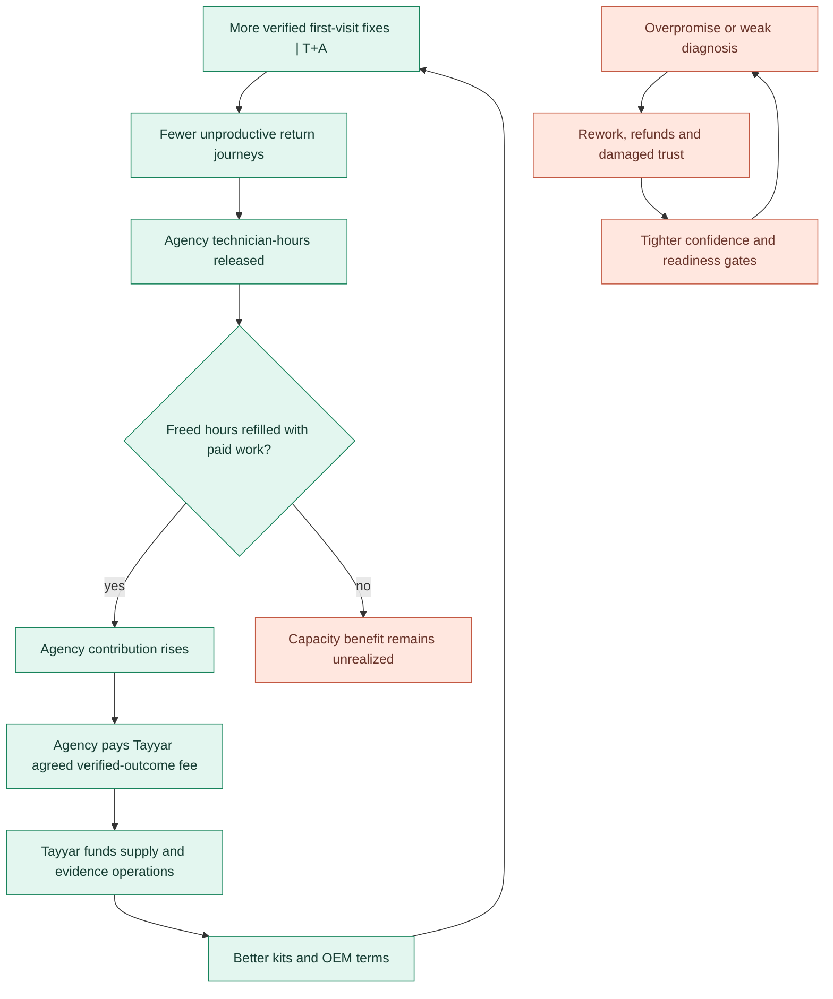

**This has two reinforcing loops and one balancing loop.** R1, better evidence and OEM kits → more verified prepared fixes → freed/refilled capacity → agency ROI → fees that finance better supply. R2, accurate SKU demand → supplier terms and availability → more instrumented cases → better forecasts. B1, misses and rework → tighter readiness and human review → fewer unsupported promises. B1 can also reduce coverage or delay service; monitor access across neighborhoods and machine ages. A growing marketplace can create perverse incentives to sell unnecessary parts; require actual fault evidence, part return accounting and independent technician review.

| Metric and cohort | Numerator/denominator; when counted | Why the agency cares; guardrail |
|---|---|---|
| **Verified first-visit fix rate** | Eligible accepted household incidents with a first physical visit and representative pass plus no same-fault return within contracted observation window / **all accepted eligible incidents with first physical visit**, including honest inspection-only and unknown outcome as non-success. | True prepared-fix improvement; report case mix, warranty transfers and rejected leads separately. |
| **Incremental agency gross contribution per technician-hour** | Household fees + agreed part margin − labour wage, part COGS, shipping, rework, refunds and Tayyar fees, divided by paid technician hours (including parts trips, travel and rework). | The buyer's actual purchase criterion; does not assume freed hours generate revenue. |
| **Freed-hour refill rate** | Hours recovered from avoidable return visits and redeployed to paid completed jobs / hours actually recovered. | Distinguishes operational capacity from realized agency earnings. |
| **Time and household burden** | Hours from incident report to restored function; technician visit count; household calls and chasing actions. | Preserves the household promise. |
| **Tayyar gross contribution** | B2B success/coordination fees plus disclosed marketplace margin minus Gnani, Delhivery, Pine, human review, kit carrying, refunds borne and acquisition cost. | Tests whether Tayyar can afford outcome-linked pricing. |
| **Readiness precision** | Repair-ready promises leading to worker, usable part, access and eligible authority at start / all ready promises. | Penalizes false certainty; by city, agency and model. |
| **Diagnosis and kit quality** | Correct top candidate, part used/kit shipped, returns/damage and genuine-part share, weighted by model and difficulty. | Detects overstock and needless part sales. |
| **Agency fairness and workforce health** | Rejected cases, worker earnings, diagnostic compensation, incident/rework load, agency churn. | Prevents arbitrage on workers and difficult households. |
| **Dispute, safety and leakage** | Chargebacks, payment/agency invoice disputes, unsafe checks, wrongful unauthorized entry, warranty leakage and unresolved case age. | Stop or tighten automation when trust falls. |

**Illustrative agency contract choices, to test with agencies:**

| Contract | Agency pays Tayyar when | Advantage | Failure mode and protection |
|---|---|---|---|
| Verified success fee | A qualifying first-visit fix survives a defined guarantee period. | Direct alignment to agency ROI. | Agency may reject hard jobs; track offered/accepted cohorts and pay a smaller diagnostic fee. |
| Fee per incremental fix above agreed baseline | Verified fixes above risk-adjusted agency baseline. | Pays for measured lift rather than inherent easy cases. | Small agencies lack stable baseline; shadow measurement and confidence range before billing. |
| Subscription plus outcome bonus | Monthly agency access/ops fee plus verified improvement. | Covers fixed integration and human review. | Agency needs consistent case volume; clearly state the guarantee and cancellation rights. |
| Marketplace transaction fee | Agency or supplier pays disclosed margin on used authentic parts. | Funds inventory infrastructure. | Conflicts with repair neutrality; no unnecessary part recommendations and separate review. |

**No numerical promise is asserted.** A worked financial case needs local interview/agency baseline: failure mix, initial visit count, paid hours, travel and diagnostic wage, genuine part availability, returns cost, household price elasticity and dispute rate. Household charges and agency fees are separate economic flows, even when both use Pine Labs for eligible transactions.

## 9. Evidence anchors and capability boundaries

**Primary competition context:** [2026 competition page](https://the-ken.com/case-competition-2026/) and the team's `round2_vision.md`, `round2_strategy.md` and `phase2_research.md`. The existing team's Round 1 evidence includes customer and technician interviews and mentor Vidya Sagar's observation that a wrong part can turn a visit into several trips. It supports a *problem hypothesis*, not a measured first-visit lift or proof that the B2B price model works. The team strategy files supply the OEM-parts, local-agency, Passport and later marketplace direction; this atlas makes them explicit rather than proposing a new opening.

**Official partner documentation checked for the labels in this atlas:**

- [Gnani speech API quick start](https://docs.gnani.ai/api/introduction/quick-start): STT `POST /stt/v3`, streaming STT and TTS examples. A transcript/synthesized response is a capability; role authority, machine diagnosis and audio-fault interpretation require Tayyar or new interfaces.
- [Delhivery Maps API](https://www.delhivery.com/maps/reference): geocoding and distance matrix give address and travel estimates; they do not hold a technician's calendar. [Delhivery B2C portal](https://one.delhivery.com/developer-portal/documents/b2c/) and [B2B portal](https://one.delhivery.com/developer-portal/documents/b2b/) are shipment domains. Exact reverse, webhook, intercity and city serviceability require account and endpoint validation. A tracking record is not proof of worker handoff.
- [Pine Labs P3P quick start](https://www.pinelabs.com/docs/online-payments/ai/p3p/quickstart): mandate and eligible paid-resource flow using grant verification and receipts; reserve-balance availability is payment-method dependent. [Pine Labs split settlements](https://www.pinelabs.com/docs/online-payments/split-settlements): multi-party payouts require activation. A payment receipt is not proof of physical service outcome.

**What remains explicitly unproven:** agency willingness to pay Tayyar rather than buy software at a fixed price; a trustworthy agency counterfactual; OEM data and genuine-parts contract rights; consenting, portable Passport identity across brands; same-day Tier 2 part movement; safe household use of the voice channel; financial settlement and liability allocation for contingent repairs; and whether a larger parts business improves agency trust. These are design dependencies in the full flow, not grounds to erase the intended future states.

## 10. How to read and use this atlas for Round 2

1. **Outcome question:** read the two jobs, the `S5` ready gate and `S8–S9` success predicate; agency fees use verified outcomes rather than raw booking volume.
2. **Agent autonomy:** use the decision ledger to say what Tayyar may schedule/source/replan on its own and who can veto entry, safety, warranty, new scope and a billed B2B success.
3. **Happy/unhappy flow:** the master `S0–S11` map plus the `R1–R12` recovery table span launch through recurrence and future business.
4. **Rails question:** use the stage capability overlay; each `X` appears at the exact touchpoint at which a new partner capability would matter.
5. **Fourth rail:** Machine Passport (`X-4`) is a machine identity/history domain. OEM parts access (`X-O`) and workforce supply (`X-A`) are distinct dependencies, not renamings of a fourth rail.
6. **Human interaction:** the stakeholder table and seven interfaces give the household, remote payer, agency, worker, seller, OEM and human reviewer separate rights.
7. **Commercial story:** use the B2B two-money ledger, cohort definition and agency contract choices; future OEM-backed marketplace is grounded in observed used/unused SKU economics.
8. **Reality check:** the official documentation anchors distinguish `G/D/P` from Tayyar-owned `T` and proposed `X`. We can design the complete ambition now while being exact about which partner interface would have to be built.

**The central strategic sentence:** *Tayyar sells local repair agencies a verified improvement in completed prepared repairs, while the household gains one accountable owner who restores function without making them manage the repair. Each consented case improves the Machine Passport, OEM/dealer sourcing, agency kits and ultimately an open parts and maintenance network.*
