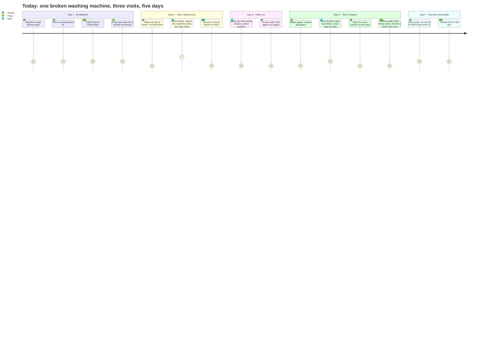
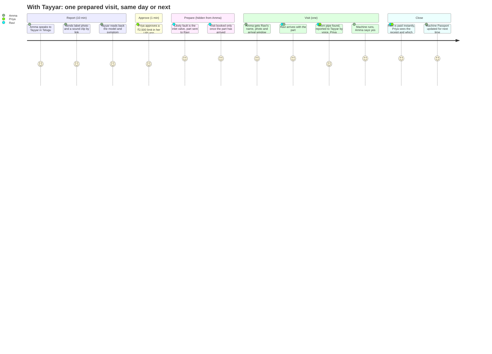
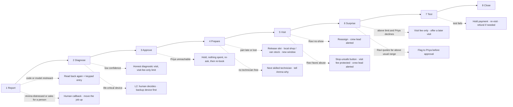

# User Journey: Today vs. with Tayyar

**Vision:** *Every technician visit arrives ready.* (see `round2_vision.md`)
**Related:** rail integration map in `phase2_research.md` §3.1 · states and unhappy paths in `round2_vision.md` Q3 · test plan in `round2_strategy.md` §9

---

## The scenario (a composite, built from our interviews)

**Where:** Eluru, a tier-3 city. **What:** the washing machine stops taking in water.

| Person | Who they are | Based on |
|---|---|---|
| **Amma** (user) | 58, at home, speaks Telugu, uses WhatsApp for voice notes | Prathyusha's mom relies on "trusted intermediaries… across multiple visits for one repair"; Sai Kakki's washing-machine inlet repair |
| **Priya** (payer) | Daughter, works in Hyderabad, pays for household repairs | Maggi manages her Vizag home through her aunt; Sri Charan's family spends ₹10,000/month on machines |
| **Ravi** (technician) | Part of a local ten-person crew; buys parts himself | The carpenter crew in our Round 1 Q1; Sai Kakki: *"the technician himself goes out and gets the parts"* |
| **Crew lead** (agency) | Assigns jobs by urgency and seniority | Technician interview |
| **Parts shop** | Local counter, no inventory system, takes UPI | Vidya Sagar: wrong part → *"three trips"* |

---

## 1. TODAY: the journey without Tayyar

*(Scores run from 1 = painful to 5 = good. They're our judgement from the interviews, not measured.)*

### Pain points and the evidence behind them

| # | Stage | Pain | Who feels it | From our interviews |
|---|---|---|---|---|
| P1 | Breakdown | Nobody knows what's wrong until a visit | Amma, Ravi | Round 1 Q2 insight: people try remembered fixes and send photos |
| P2 | Waiting | A day lost waiting, with no fixed time | Amma | Maggi: urgent repairs take *"half of the day or one day"*; people *"will not come at time"* |
| P3 | Visit 1 | **The first visit is for discovery only** | Amma, Ravi | Vidya Sagar: *"come first to diagnose, then go get back the parts"* |
| P4 | Parts | Wrong part → more trips | Ravi, Amma | Vidya Sagar: *"he might have to make three trips"* |
| P5 | Mid-repair | Price rises on the spot | Priya, Amma | RK Sir: *"they identify issues with capacitor… then they charge more"* |
| P6 | Approval | The person paying isn't there; the person at home can't judge | Priya | Maggi: when Mom is home alone she *"will not recheck"* |
| P7 | Trust | No proof of which part was fitted | Amma, Priya | Maggi's *"strict order: only this part"*; Sai Kakki's poor-quality tap |
| P8 | After | No history; the next breakdown starts from zero | Everyone | RK Sir: *"within no time it gets spoiled again"* |
| P9 | Agency | Ravi's day goes into trips, not repairs | Ravi, crew lead | Technician interview; the business case in `round2_strategy.md` §4 |

---

## 2. WITH TAYYAR: the same breakdown

### Stage by stage: what each person sees vs. what happens behind the scenes

| Stage | Amma (user) | Priya (payer) | Ravi (technician) | Crew lead (agency) | Tayyar and the rails, behind the scenes | Fixes pain |
|---|---|---|---|---|---|---|
| **1. Report** | Calls Tayyar (or gets a call) in Telugu. Short questions; model and error code read back; "press 1 if correct." Gets an SMS link for a label photo and a 10-second sound clip | Gets a message: "Amma reported a washing-machine problem" | — | — | **Gnani** phone agent: STT + slot-filling (`machine`, `symptom`, `error_code`), DTMF confirm; SMS link for media (voice agents take no images). **Machine Passport** checked for model, warranty and past repairs | P1 |
| **2. Diagnose** | "Most likely the water inlet valve. We'll send a technician with the part." | Sees the likely cause and estimated cost range | — | — | **Our** diagnosis model (not Gnani): transcript + photo + sound + passport → top-2 faults and parts. Low confidence → an honestly labelled diagnostic visit instead | P1, P3 |
| **3. Approve** | Told: "Priya is approving the cost" | **Approves one plain limit in her UPI app:** "Tayyar can never spend more than ₹2,500" | — | — | **Pine Labs P3P:** `POST /mpp/v1/mandate` → QR/deep link → UPI One-Time Mandate or Reserve Pay; Grantex `max_txn_paise` scope set | P6 |
| **4. Prepare** | Nothing to do. Gets one update: "Part ordered; visit tomorrow 10–12" | Same update | Gets the job card: evidence, likely cause, "part arriving 8 PM," customer window | Sees the job auto-assigned (skill first, then travel time); can override | **Pine Labs** pays the parts shop (P3P). **Delhivery** sends the part to Ravi and the tracking push confirms delivery. **Maps** distance matrix ranks technicians; **our** matcher picks Ravi. **Ready gate:** the slot is confirmed only once the address, Ravi, the part and Amma's window all check out | P2, P3, P4, P9 |
| **5. Visit** | Gets Ravi's name, photo and arrival window; lets him in (entry was approved in step 3) | "Ravi has arrived" | Checks in on the job card and fits the valve | — | Check-in → **Pine Labs** captures the visit fee | P2 |
| **6. Surprise** | Ravi tells her in person: "the pipe is worn too" | **Approval request in UPI:** "Worn inlet pipe, ₹180 (usual range ₹150–250). Approve?" | **Presses "Call Tayyar" and says in Telugu:** "pipe also worn, one-eighty." Tayyar reads it back and he presses 1; photo sent by link | — | **Gnani** captures `part` and `amount` from the assigned technician's number only. **Our** check: price range, remaining limit, approved scope. Within limit and small → auto-approve; otherwise → payer's UPI. **Voice never approves money** | P5, P6 |
| **7. Test** | Watches it fill and spin. Tayyar: "Is it working? Say yes or press 1." | "Machine confirmed working" | Uploads a short test video | — | Functional test = closing condition. **Pine Labs** captures parts and labour within the limit and releases the rest of the block | P7 |
| **8. Close** | Done in one visit | Receipt: parts fitted (with photos), amounts, a 30-day repair warranty | **Paid instantly** (Pine Labs payout/split) | Sees one job closed and the time saved | **Machine Passport** records the model, fault, part SKU, price, test result and technician. Unused second part → **Delhivery** reverse pickup → **Pine Labs** refund | P7, P8 |
| **9. After** | 7 days later: "Still working?" (one Gnani call) | — | Repeat work is his if it fails | Sees which parts fail most often (Q7 parts marketplace) | Passport + (optional) smart-plug power pattern → early warning next time | P8 |

---

## 3. Where the journey can break: unhappy branches

Every branch ends in a defined state, never in silence. The details are in `round2_vision.md` Q3. Branches confirmed by tomorrow's Gnani tests (G1–G9) should be marked **"found in testing."**

---

## 4. Today vs. Tayyar: at a glance

| | Today | With Tayyar |
|---|---|---|
| Visits | 2–3 | **1** (2 if the fault truly needs an inspection, labelled honestly) |
| Days disrupted | 3–5 | **1** |
| Calls Amma makes | Many (chasing, checking price) | **1** (the report) |
| Who approves money | Amma on the spot, or phone calls to Priya | **Priya, in UPI, within a limit she set** |
| Price surprises | Common, checked through friends | Flagged against the usual range before approval |
| Proof of the part fitted | None | Photo + receipt + Passport record |
| Ravi's time | Discovery visit + parts run + repair visit | **One repair visit; the rest goes to other paid jobs** |
| Next breakdown | Starts from zero | Starts from the Passport |

*(These are the design targets for this scenario, not measured results. Numbers from the carpenter-crew call and pilots should replace them.)*

---

## 5. The emotional arc (for the Q2/Q6 story)

- **Today:** worry → waiting → hope (Ravi arrives) → **disappointment** (no part) → frustration (chasing) → **suspicion** (price rises) → doubt (will it last?).
- **With Tayyar:** worry → **reassurance** (someone understood, in Telugu) → **control** (Priya's limit) → calm (one window, with his name and photo) → **trust** (the surprise explained, a fair-price check, proof of the part) → relief (working, done).

The moment that matters most is **step 4 (Prepare)**. Amma does nothing and sees one message, while all three rails work behind the scenes. That invisible step is how the first visit becomes a repair.
