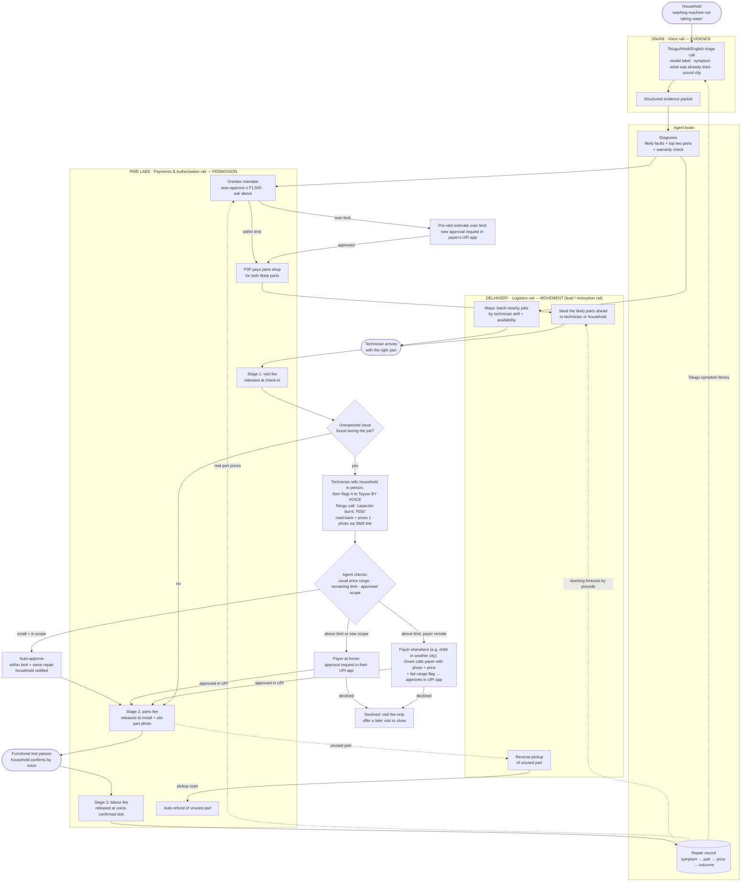

# Phase 2 Research — How Gnani, Pine Labs and Delhivery Work Together

**Purpose**: work out how the three rail partners combine to deliver our Round 1 answer, for the rails round (Phase 2). Built from our Round 1 submission ([Google Doc](https://docs.google.com/document/d/1xZOr7RvvDMZi_kx9gnVklVcWvbrX0dg8D03ldTofdl0/edit?tab=t.0)), the interview transcripts in `evidence/Interviews/Transcripts/` and `evidence/Vidya Sagar transcript.md`, and the rail definitions in `context.md` and `Keeping_Machines_Running_Context.md` §7.

---

## 1. What we committed to in Round 1

| Question | Our answer (short) |
|---|---|
| **Q2 insight** | When a machine breaks, people are protecting their routine as much as their money. **The first visit should not be for discovery.** Gather the evidence beforehand so the technician arrives ready to repair. |
| **Q3 loop** | Report (voice/chat/photo/video) → knows machine and history → gathers evidence and predicts parts before dispatch → coordinates technicians, agencies, brands, suppliers → asks approval for entry, removal, risky work, spending over limits → closes on a functional test and records the outcome |
| **Q4 rails** | Payments: repair wallet with user-approved limits, milestone release, escalation of unexpected costs. Logistics: routes the right technician and likely parts together. Voice: gathers symptoms, errors, photos and sounds before dispatch. |
| **Q5 innovation rail** | **Logistics.** Diagnosis-aware repair routing: predict likely faults and parts, check warranty, batch nearby jobs by technician skill, to get more first-trip fixes. |
| **Q6 asset** | Quick machine evidence: model label, symptom, error photo/video/voice note |
| **Q7 annexation** | A repair-parts marketplace built on predicted part demand |
| **Q9 incumbent** | Urban Company. Its model depends on owning the paid visit, so fixing things before a paid visit works against it. |

**Implication for Phase 2**: Delhivery is our **lead** rail. Gnani and Pine Labs **feed** it. Every design choice should make that clear.

---

## 2. The partners and what each one gives us

| Rail | Partner | What's open to teams | Role in our solution |
|---|---|---|---|
| Voice | **Gnani** | Indian voice AI, 12+ languages, Inya VoiceOS; APIs opened for voice-first teams | **Evidence**: a triage conversation in Telugu/Hindi/English before dispatch; mid-job approval calls; voice sign-off at the end |
| Payments & Authorisation (**one rail**) | **Pine Labs** | P3P (agent-to-agent UPI/card payments) + Grantex (spend limits, revocable mandates, audit trail) | **Permission**: pay for parts before the visit, release payment in stages, record every approval |
| Logistics | **Delhivery** | Maps and MCP systems opened to teams | **Movement**: batch nearby jobs, send the likely part ahead of the technician, collect unused parts |

---

## 3. The core idea: a "ready-to-repair" handoff chain

Each rail's output is the **trigger** for the next. None of the three can deliver a first-trip fix alone:

- Gnani alone gives a good description of the problem, but nobody can act on it.
- Pine Labs alone gives permission to spend, but there's no part to spend on.
- Delhivery alone moves parcels, but doesn't know which part to move.

Linked together, they turn a broken machine into a technician who arrives with the right part and permission to fit it.

### 3.1 Rail integration diagram

### 3.2 The same chain in one line

**Gnani captures the evidence → the agent predicts the parts → Pine Labs gives permission to spend → Delhivery sends the part ahead → technician fixes on the first visit (any surprise is reported to Tayyar by voice and approved by the payer in UPI) → Pine Labs releases payment in stages → Gnani confirms → the record improves the next job.**

---

## 4. Three joint mechanisms that need all three rails

### 4.1 Send the two likely parts, return the unused one
- **Problem**: diagnosis is never certain. If you guess one part and guess wrong, you're back to multiple trips.
- **Mechanism**: ship the **top two** likely parts under one pre-approved spend. The technician fits the correct one. Delhivery collects the other, and **the pickup scan triggers an automatic Pine Labs refund**.
- **Why all three**: Gnani's evidence narrows the choice to two; Pine Labs pays for both up front and refunds one; Delhivery handles delivery and return.
- **Evidence**: Vidya Sagar: *"If by mistake he gets incorrect parts or any parts, then he might have to make three trips."* He also described the current pattern: *"come first to diagnose, then go get back the parts, maybe make it work, may not work."*

### 4.2 Payment released in stages, with a voice check on unexpected costs
- **Stages**:
  1. Visit fee: paid at technician check-in
  2. Parts fee: paid at install, with a photo of the old part
  3. Labour fee: paid when the household confirms by voice that the machine works
- **Unexpected costs** (technician-reported, voice-first):
  1. The technician explains the new fault to the household in person, as he does today.
  2. He then **tells Tayyar by voice**: he presses "Call Tayyar" on his job card and says, in Telugu, "the capacitor is burnt, ₹650." The Gnani phone agent captures `part` and `amount`, reads both back, and he **presses 1 to confirm**. Gnani documents no recognition confidence, so "six-fifty" vs "sixteen-fifty" needs keypad confirmation. A photo of the faulty part follows through an SMS link, because Gnani voice agents take no images.
  3. The agent accepts this only from the phone number of the technician assigned to the job. **The technician's voice is a claim, not an approval.**
  4. The agent checks the price against the usual range, the remaining limit and the approved repair scope:
     - **small and within scope** → auto-approved, household notified;
     - **above the limit or new scope, payer at home** → approval request in their UPI app;
     - **payer elsewhere** → Gnani calls the payer with the photo, the price and a fair-range flag ("usually ₹400–600") → the payer approves in their UPI app;
     - **declined** → visit fee only, and a later visit is offered.
  5. Voice never authorises money. Only the payer's UPI app does.
- **Why the technician uses Tayyar instead of a direct cash deal:**
  - he isn't paid for extra work unless it's logged, because Pine Labs can't collect above the approved limit without a new UPI approval;
  - he's paid the moment the functional test passes;
  - only logged work carries the repair warranty and goes into the Machine Passport;
  - a fixed parts-handling fee protects his parts margin.
- **Privacy:** Tayyar doesn't listen in on the technician's conversation with the household (no always-on microphone in the home).
- **Evidence**: RK Sir: called for foam-jet cleaning, *"they identify issues with capacitor and other things then they charge more."* He only checked a ₹3,000–4,000 chemical-wash quote by phoning a friend who knows other mechanics (₹2,500–3,000 elsewhere).

### 4.3 Proof of which part went in
- **Mechanism**: Delhivery's tracking shows which part reached the job, Pine Labs has the receipt for that exact part, and Gnani records the household's confirmation. Together that proves which part went into the machine.
- **Evidence**: Maggi: gives the technician a *"very strict order… I want only this part to be replaced,"* because when Mom is home alone *"she'll not recheck it."* She wants to see the old part next to the new one. Sai Kakki: a replacement water-filter tap turned out to be poor quality, and they only found out after using it for a while.

---

## 5. Why this suits our tier-3 angle (Eluru)

| Rail | Tier-3 advantage |
|---|---|
| Gnani | Local repair runs on phone calls and Telugu. A voice-first, vernacular agent fits how people already work there, not an app flow. |
| Pine Labs | The local parts shop or appliance dealer may already take card or UPI payments, which is Pine Labs' merchant base. P3P can pay a shop the family already trusts rather than a new marketplace vendor. |
| Delhivery | Parts are harder to find in small cities, so pre-positioning them saves more trips there than in Hyderabad. Delhivery's pincode reach is the enabler. |
| Team access | Our Q1 claim of a carpenter who runs a ten-man crew and subcontracts plumbers, electricians and technicians gives us a real crew to test job batching on. |

**Our Q1 story maps onto this directly**: Prathyusha's mom *"relies on trusted intermediaries to coordinate technicians across multiple visits for one repair."* The chain does the intermediary's job: collecting information (Gnani), approving spends (Pine Labs) and arranging runs for parts (Delhivery).

---

## 6. Link to Q7: the repair record feeds the parts marketplace

Every completed job produces a record: **symptom → part fitted → price paid → did the fix hold.**

| Who benefits | What they get from the record |
|---|---|
| Delhivery | Part demand by pincode, so it can stock parts before they're needed (the start of the Q7 marketplace) |
| Pine Labs | Real part and labour prices, so spend limits become "fair price" limits rather than arbitrary caps |
| Gnani | A Telugu/Hindi library of household symptom descriptions, which makes each triage sharper |
| Household | A service history for each machine. This also covers Sai Kakki's ask: *"I would like them to schedule the annual servicing remembering the date."* |

---

## 7. Supporting evidence from interviews (quick index)

| Respondent | What they said | Supports |
|---|---|---|
| **Sai Kakki** | Technician asked for the model number, asked a few questions, guessed a pipe issue, *brought the part* and fixed it in one visit | The **happy path already happens informally**. We're making it standard, not inventing it. |
| **Sai Kakki** | *"The technician himself goes out and gets the parts"* | Risk: technicians control parts sourcing today (§8) |
| **Vidya Sagar** | Wrong part → up to three trips | Joint mechanism 4.1 |
| **RK Sir** | Mid-job price creep; checked the quote through a friend; AMC work handed to local franchises with *"no proper result"* | Joint mechanism 4.2; brand service doesn't solve it either |
| **RK Sir** | Trusts brand service centres without question, questions local mechanics a lot | Proof of which part went in (4.3) is what makes a local technician as trustworthy as a brand centre |
| **Maggi** | Strict "only this part" order; Mom won't recheck; urgent repairs take *"half of the day or one day"* | Joint mechanism 4.3; the routine-disruption framing from Q2 |
| **Maggi** | Her aunt handles repairs in Vizag and she *"trust[s] her blindly… I'll just directly pay"* | Households already hand this job to a trusted person. Grantex limits are the software version of that. |
| **Amma** | Purifier parts replaced routinely; AC gas refills via Urban Company | Consumables and servicing need logistics (RO filters) |
| **Sarala Aunty** | A motor failure is urgent because the tank must be filled by evening | Urgency sorting in dispatch batching |

---

## 8. Weak spots to prepare for in the rails round

1. **Labour-only jobs** (cleaning, gas refills, clogs, resets) don't use logistics. **Say so openly.** For these jobs the chain is voice + payments only. The rules allow a rail to have no role if justified, and pretending otherwise hurts credibility.
2. **Technician incentives**: technicians usually buy parts themselves (Sai Kakki), and the parts markup is part of their income. Sending parts ahead takes that away. **We need an answer**, for example a fixed parts-handling fee paid through P3P, or letting the technician's own supplier be the shop that P3P pays and Delhivery collects from.
3. **Diagnosis accuracy**: sending two parts only works if the top-two guess is usually right. We need a rough estimate, from the technician interview and the carpenter's crew, of how often a remote description plus a photo points to the right part.
4. **Returns cost money**: collecting unused parts adds a logistics cost. Check that it's cheaper than one wasted technician trip. It almost certainly is, but we should show the numbers.
5. **Elderly users**: the voice-confirmed test and approval calls have to work for a parent with no smartphone habit, so voice-only paths must be complete end to end.

---

## 9. Questions for partner office hours

| Partner | Question |
|---|---|
| **Pine Labs** | Does Grantex support **conditional/staged release** (pay on event X), or only spending caps? Can one mandate cover a **pay-then-refund** pair across two merchants? |
| **Pine Labs** | Can P3P pay small local merchants (a parts shop in Eluru) that aren't on a marketplace? |
| **Delhivery** | Same-day or next-morning delivery in **Eluru** and similar tier-3 pincodes? Does the Maps/MCP access support **multi-stop batching** and **reverse pickup** triggers? |
| **Delhivery** | Can a pickup scan event trigger an outside system through a webhook (for the refund)? |
| **Gnani** | Do the APIs support **outbound calls on the household's behalf** (to agencies and technicians), not only inbound? |
| **Gnani** | Can a call capture **non-speech audio** (a motor hum, compressor noise) as evidence? Telugu dialect coverage for Coastal Andhra? |

---

## 10. Next steps

- [ ] Put the §3.1 diagram into the Round 2 deck (redraw in slide style; keep this Mermaid version as the source of truth)
- [ ] Get answers to §9 at office hours and update this file
- [ ] Ask the carpenter's crew and technician contacts how often a remote description correctly predicts the part (§8.3)
- [ ] Draft the technician-incentive answer (§8.2) before the finale, since investors will ask
- [ ] Rough cost comparison: one reverse pickup vs. one wasted technician trip (§8.4)
